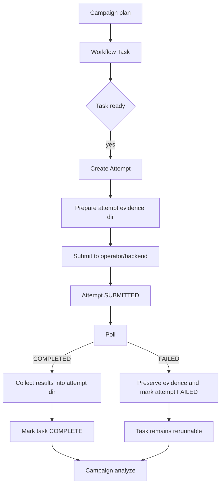

# DevGuide_v0.2.5 – Provenance-Safe Reruns (Task Attempts) & Robust Debug/Resume

## [AGENT::SUMMARY]

* **PROJECT:** MatterStack v0.2.5 (Platform Refactor)
* **GOAL:** Enable precise, repeatable, provenance-safe iteration on long-running workflows without needing to start a brand new run for every debug fix.
* **PRIMARY DELIVERABLE:** First-class **Task Attempts** in the core platform, with schema + lifecycle + CLI + evidence export changes.
* **DRIVERS:**
  * HPC queue time and walltime mistakes make “re-run just the failed stage” mandatory.
  * Evidence bundles must preserve chain-of-custody across reruns (no artifact overwrite).
  * Runs must be revivable/resumable in a controlled manner (without DB hand edits).
* **NON-GOALS (for v0.2.5):**
  * Full container-to-Apptainer implementation (not required to deliver attempt semantics).
  * Full event-driven orchestration (poll loop stays).
  * Workspace-specific migration automation for every legacy workspace (we will provide a generic migration helper design; MXene migration can follow after core validation).

---

## 1. Problem Statement

MatterStack currently models:
* A **Task** as a DAG node, persisted in SQLite.
* An **ExternalRunHandle** as the execution state for that Task (1:1 by `task_id`).

This causes platform-level friction during debugging:
1. **Rerun destroys provenance:** rerunning the same `task_id` risks overwriting `submit.sh`, stdout/stderr, and outputs.
2. **No notion of execution attempts:** a “task that failed due to walltime” is logically the same Task, but execution is a new trial with new config.
3. **Terminal run status blocks progress:** a run marked `FAILED` can’t be resumed without manual interventions.
4. **Config drift is not captured:** if `simulation_config.json` changes between reruns, we lack an authoritative record tying a specific execution to a specific configuration revision.

This conflicts directly with the “Evidence Bundle” philosophy and long-run robustness goals described in:
* [`docs/architecture.md`](../architecture.md:1)
* [`docs/evidence_bundles.md`](../evidence_bundles.md:1)
* [`docs/roadmap.md`](../roadmap.md:1)

---

## 2. Target Outcome (v0.2.5)

### 2.1 Definitions

**Task (Logical Node)**
* Stable identity within a run: `task_id`
* Dependencies, command template, resource intent
* Can be “pending/complete” logically

**Attempt (Execution Trial)**
* Immutable execution record for a Task
* New identifier per rerun: `attempt_id`
* Captures: job id(s), operator/backend metadata, timestamps, config snapshots, evidence paths
* Can be multiple per Task (attempt history)

### 2.2 Guarantees

1. **Provenance Safety:** no attempt overwrites prior attempt artifacts.
2. **Repeatability:** each attempt references an immutable config snapshot (hash + stored content).
3. **Precision Reruns:** rerun a specific Task (or subtree) without restarting the run.
4. **Controlled Revival:** terminal runs can be revived into `RUNNING` via CLI with an audit note.
5. **Idempotency:** orchestrator can restart and continue without duplicating attempts.

---

## 3. Architecture Changes

### 3.1 New Persistence Model: Task Attempts

Current schema is v1, with tables:
* `runs`
* `tasks`
* `external_runs` (1:1 with task_id)

Refactor to schema v2:
* Keep `runs`
* Keep `tasks` (logical definition + logical status)
* Replace/augment `external_runs` with `task_attempts` (1:N attempts per task)
* Keep a “current attempt” pointer for convenience

#### Proposed Tables (v2)

**`tasks`**
* `task_id` (PK)
* `run_id`
* task definition fields (existing)
* **logical_status** (e.g. PENDING, BLOCKED, COMPLETE, FAILED_LOGICAL)
* **current_attempt_id** (nullable)

**`task_attempts`**
* `attempt_id` (PK; uuid)
* `task_id` (FK -> tasks.task_id)
* `run_id` (FK -> runs.run_id) (denormalized for efficient queries)
* `attempt_index` (int, monotonically increasing per task, optional)
* `status` (CREATED/SUBMITTED/RUNNING/COMPLETED/FAILED/CANCELLED/WAITING_EXTERNAL)
* `external_id` (job id)
* `operator_type`
* `operator_data` (JSON)
* `created_at`, `submitted_at`, `ended_at`
* `reason` / `error_message` fields
* **evidence_local_path** (relative to run root, points to attempts directory)
* **workdir_remote** (string, remote workdir for this attempt)
* **config_snapshot** fields:
  * `config_hash`
  * `config_files` (JSON list of snapshot file names)
  * `config_payload` (JSON or separate blob table; see below)

**`run_events`** (optional but strongly recommended)
* Immutable audit log for manual interventions
* `event_id`, `run_id`, `timestamp`, `actor`, `action`, `payload`

> Storage of config snapshots: keep it simple. Store snapshot files in the filesystem (attempt evidence directory) and store hashes/paths in DB. Avoid stuffing large blobs into SQLite JSON columns.

### 3.2 Filesystem Layout

#### Run Root

```
runs/<run_id>/
├── state.sqlite
├── run.lock
├── campaign_state.json
├── tasks/
│   └── <task_id>/
│       └── attempts/
│           └── <attempt_id>/
│               ├── manifest.json
│               ├── submit.sh
│               ├── stdout.log
│               ├── stderr.log
│               ├── config_snapshot/
│               │   ├── simulation_config.json
│               │   ├── config.json
│               │   └── hpc_profile.yaml
│               └── outputs/...
└── evidence/  (exported bundles)
```

This aligns with the “Evidence Bundle is a directory of files” definition in [`docs/evidence_bundles.md`](../evidence_bundles.md:9), while preserving attempt history.

### 3.3 Remote Workdir Layout (HPC)

Each attempt must get its own remote directory to avoid collisions:

```
<remote_root>/<workspace_slug>/<run_id>/<task_id>/<attempt_id>/
```

This directly solves:
* “rerun overwrote submit.sh”
* “remote dir contains mixed outputs from old and new attempt”

---

## 4. Orchestrator Semantics (Plan → Execute → Analyze)

### 4.1 Task Readiness
A Task is “ready” when:
* It has logical status PENDING (or READY)
* All dependencies are logically COMPLETE (or allowed to fail)
* It has no active attempt (attempt status in SUBMITTED/RUNNING/WAITING_EXTERNAL)

### 4.2 Submitting Work
When orchestrator decides to run a task:
1. Create new attempt record in DB (status CREATED)
2. Materialize attempt directory and write:
   * task manifest
   * config snapshot
3. Operator prepares + submits using attempt-scoped local_dir and remote_dir
4. Update attempt status to SUBMITTED, store job id
5. Update task.current_attempt_id = this attempt

### 4.3 Polling Work
Polling operates over active attempts (not tasks):
* If attempt transitions to COMPLETED:
  * collect results into attempt dir
  * mark attempt COMPLETED
  * update logical task status to COMPLETE
* If attempt FAILED:
  * mark attempt FAILED
  * logical task status becomes FAILED_LOGICAL (unless allow_failure)
  * run-level status may become FAILED depending on fail-fast policy

### 4.4 Analyze Phase
The campaign receives results referencing *attempt artifacts*.
This becomes explicit: outputs are always read from `tasks/<task_id>/attempts/<attempt_id>/...`.

---

## 5. CLI / UX: Robust Iteration Without Manual DB Changes

### 5.1 New/Updated Commands

MatterStack’s current CLI is a **flat** set of subcommands (not `matterstack run ...`). v0.2.5 should follow this convention for consistency with [`matterstack/cli/main.py`](../../matterstack/cli/main.py:1).

**`matterstack revive <run_id>`**
* If status is terminal, set to RUNNING (or PENDING) with an audit entry in `run_events`.

**`matterstack rerun <run_id> <task_id> [--recursive]`**
* Creates a new attempt for target and optionally dependents.
* Resets logical statuses to PENDING.
* Does NOT delete prior evidence.

**`matterstack reset-task <run_id> <task_id> [--recursive]`**
* Pure logical reset to PENDING; does not create a new attempt immediately.
* Next scheduler tick will create a new attempt.

**`matterstack attempts <run_id> <task_id>`**
* Lists attempt history (attempt_id, status, job id, timestamps, config hash).

**`matterstack cancel-attempt <run_id> <attempt_id>`**
* Cancels the external job and marks the attempt CANCELLED.

> Note: Keep legacy `reset-run` for backward compatibility but deprecate it in favor of attempt-aware commands.

### 5.2 Provenance and Audit
All manual changes (revive/rerun/reset/cancel) append a `run_event` with:
* who/what triggered it
* when
* which tasks/attempts
* reason string (optional)

### 5.3 Evidence + Diagnostics Must Become Attempt-Aware
Two core system features need to pivot from “task has one external run” to “task has N attempts”:

* **Evidence export:** [`build_evidence_bundle()`](../../matterstack/storage/export.py:12) currently calls `get_external_run(task_id)` and records a single artifact path per task. In v0.2.5 it must:
  * include attempt history per task (at least current attempt + prior attempts)
  * link artifacts to attempt evidence directories (no overwrite)
  * include config snapshot hashes per attempt
* **Explain/frontier diagnostics:** [`get_run_frontier()`](../../matterstack/orchestration/diagnostics.py:46) currently uses task status + `WAITING_EXTERNAL` and hints derived from `operator_data["absolute_path"]`. In v0.2.5 it must:
  * display the active attempt (attempt_id) and its operator/evidence path
  * show “READY” tasks as before, but “WAITING_EXTERNAL/RUNNING” should be attempt-scoped

---

## 6. Config Snapshots (Provenance)

Each attempt directory includes `config_snapshot/` capturing:
* `simulation_config.json` (workspace scientific config)
* run `config.json` (execution mode + concurrency caps)
* selected backend profile / YAML (e.g., HPC config used)

Additionally, store:
* sha256 of each file
* combined “attempt config hash” in DB

This ensures an attempt can always be traced to inputs used, even if workspace defaults later change.

---

## 7. Schema Migration Plan (v1 → v2)

### 7.1 Versioning
Update `CURRENT_SCHEMA_VERSION` to `2` and implement migration logic:
* On open, read schema version.
* If version == 1:
  * create new tables
  * backfill attempts from existing `external_runs` rows:
    * create one attempt per task that has an external_run record
    * set attempt_id deterministically (uuid4) and store mapping
    * set task.current_attempt_id
    * evidence paths:
      * if legacy operator dir exists: point attempt evidence to it (or copy into new layout)
  * mark schema_info.version = 2

### 7.2 Backfill Rules
* Tasks with no external_run:
  * create no attempts
* Tasks with external_run:
  * create attempt with status == external_run.status
  * move/alias operator_data and external_id
  * attempt evidence directory:
    * simplest: treat existing `operators/<slug>/<uuid>` as attempt evidence root for migration, and store that relative path

Later we can add an optional “normalize evidence layout” migration tool to copy files into `tasks/<task_id>/attempts/<attempt_id>/...`.

---

## 8. HPC Validation Strategy (Live)

### 8.1 New Dedicated Workspace: Attempt Validation
Create a new workspace (example name):
* `workspaces/hpc_attempts_validation/`

It should include:
* A minimal campaign that runs 2 tasks with a dependency:
  * `task_a`: prints and writes a JSON artifact
  * `task_b`: depends on `task_a`, consumes the JSON, writes output
* The tasks should be short and suitable for `atesting`.
* Provide a validation script that:
  1. runs task_a and task_b
  2. forces task_b failure by setting short walltime or an intentional exit(1)
  3. uses CLI to rerun task_b (new attempt) with corrected config
  4. asserts both attempts exist and evidence is preserved without overwrite

Use [`workspaces/mxene_shear_demo_V2/HPC_atesting_config.yaml`](../../workspaces/mxene_shear_demo_V2/HPC_atesting_config.yaml:1) as the reference config for fast queue.

### 8.2 Success Criteria for Live HPC
* Two attempts exist for the same logical task.
* Remote directories are attempt-scoped.
* Evidence bundle export includes both attempts.
* CLI can revive a failed run and rerun without manual DB edits.

---

## 9. Test Plan (Required)

### 9.1 Unit Tests
* Schema migration v1 → v2:
  * create a temp v1 DB with tasks + external_runs
  * migrate and verify attempts created
  * verify schema_info updated
* Attempt creation logic:
  * new attempt increments attempt count
  * evidence path resolves correctly
* Config snapshot hashing:
  * stable hash for same files, changes when files change

### 9.2 Integration Tests
* Orchestrator rerun behavior:
  * run a small workflow locally
  * fail task
  * revive run and rerun
  * verify prior attempt preserved and new attempt created
* Concurrency limits apply to active attempts (not tasks)

### 9.3 E2E Tests
* CLI rerun flows:
  * `revive`
  * `rerun --recursive`
  * `attempts list`
* Workspace-level e2e (local):
  * use a tiny built-in workspace/campaign or an inline test campaign

#### Pytest startup segfault mitigation (this environment)
In this environment, importing CPython’s native `readline` extension can segfault during pytest startup (before `conftest.py` is imported). To keep the mitigation **test-scoped and opt-in**, the repo includes a startup hook in [`sitecustomize.py`](../../sitecustomize.py:1) that injects a lightweight stub `readline` module **only when** `MATTERSTACK_PYTEST_STUB_READLINE=1` is set.

Recommended invocation (targeted verification):
`MATTERSTACK_PYTEST_STUB_READLINE=1 python -m pytest -q tests/e2e/test_cli_interaction.py`

Caveat: the stub is intentionally minimal and does not provide interactive readline behavior; do not enable it for normal CLI/interactive usage.

### 9.4 Live Validation (Optional in CI, Required manually)
Run new validation workspace against atesting.

---

## 10. Implementation Thrusts (v0.2.5)

### THRUST 1: Attempts Data Model + Schema v2
1. Add models/tables
2. Add store APIs:
   * create_attempt
   * list_attempts
   * get_active_attempts
   * set_current_attempt
3. Add migration from v1

### THRUST 2: Orchestrator Refactor to Use Attempts
1. Modify poll loop to handle attempt-level external runs
2. Modify submit path to create attempts and pass attempt dirs to operators

### THRUST 3: Operator/Backend Adjustments for Attempt Workdirs
1. ComputeOperator should prepare evidence directory per attempt
2. SlurmBackend should receive attempt-scoped remote workdir
3. Download should land in attempt evidence directory

### THRUST 4: CLI Upgrade for Revive/Rerun/Attempt Inspection
1. Add `run revive`
2. Add `run rerun`
3. Add `run attempts`
4. Deprecate or wrap legacy reset behavior

### THRUST 5: Evidence Export Upgrade
Export should include attempt history and attempt metadata.

### THRUST 6: Validation Workspace + Live HPC Runbook
1. Add `hpc_attempts_validation` workspace
2. Provide a one-command validation script
3. Document how to run on atesting

---

## 11. Mermaid: Attempt-Aware Lifecycle



---

## 12. Rollout & Compatibility Notes

* v0.2.5 should ship with:
  * automatic migration for existing runs
  * backward-compatible CLI where feasible
* Existing workspaces should continue to run without changes.
* MXene workspace can remain “as is” until after core platform validation.
  * Migration helper can be added after v0.2.5 stabilization:
    * map legacy `operators/` evidence into attempts directory
    * optionally seed task results for reuse

---

## 13. Implementation Checklist (No Estimates)

1. Implement schema v2 + migration path from v1
2. Implement attempt-aware state store APIs
3. Refactor orchestrator loop to operate on attempts
4. Update ComputeOperator + SlurmBackend to use attempt-scoped dirs
5. Add CLI: revive, rerun, attempts list
6. Update evidence export to include attempts
7. Add unit/integration/e2e tests for attempts + rerun
8. Create `hpc_attempts_validation` workspace and validate using atesting config
9. Document runbook in workspace README
10. Stabilize and tag v0.2.5
