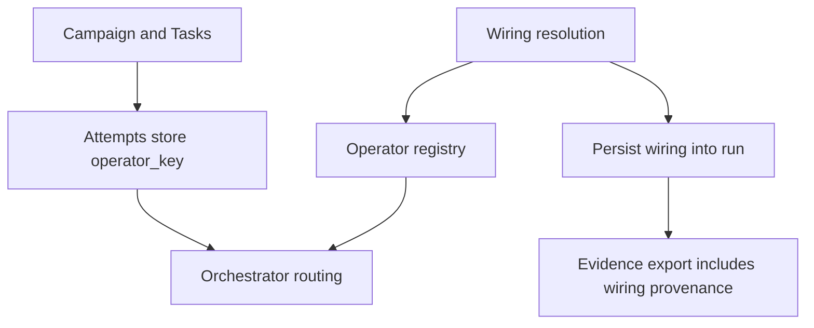
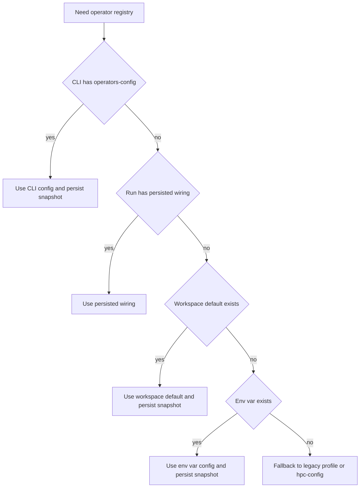

# DevGuide_v0.2.7 – Operator Wiring Discovery + Run-Persisted Provenance (Zero-Flag Resumes, Portable Campaigns)

## [AGENT::SUMMARY]

- **PROJECT:** MatterStack v0.2.7 (next robustness step after Operator System v2)
- **BASELINE:** v0.2.6 Operator System v2 delivered canonical operator keys + `operators.yaml` + schema v3 attempt `operator_key` (see [`docs/DevGuides/DevGuide_v0.2.6.md`](docs/DevGuides/DevGuide_v0.2.6.md:1) and [`docs/DevGuides/v0.2.6_Report.md`](docs/DevGuides/v0.2.6_Report.md:1)).
- **CORE PROBLEM (v0.2.6 UX gap):** users must repeatedly pass CLI wiring flags like `--operators-config`, even when they always run the same campaign with the same operator wiring.
- **GOAL (v0.2.7):** make operator wiring:
  - **discoverable by default** (workspace sensible defaults),
  - **persisted into the run for provenance + resumability** (no re-specifying flags to resume),
  - still **overrideable for debugging** (CLI can override),
  - and **site-portable** (campaign code remains free of site-specific paths/credentials).

---

## 1. Problem Statement (Why v0.2.7)

v0.2.6 intentionally separates:
- **Routing**: chosen by campaign/tasks via canonical operator keys like `hpc.default`
- **Wiring**: concrete operator instance configuration (Slurm host/partition/account, credentials, etc.) supplied at runtime via `operators.yaml` and CLI `--operators-config` (see CLI flag definition in [`matterstack/cli/main.py`](matterstack/cli/main.py:712) and precedence logic in [`matterstack/cli/operator_registry.py`](matterstack/cli/operator_registry.py:23)).

This is correct architecturally, but users experience friction:
- “I’m always running the same workspace with the same wiring; why do I have to pass `--operators-config` each time?”
- “If I resume a run later, how do I guarantee it uses the same operator wiring as the run that created the attempts?”

### What we do **not** want
- Storing absolute paths or cluster-specific details in campaign logic (non-portable).
- Quietly changing wiring across resumes because an environment variable or default changed (provenance risk).

---

## 2. Design Goals (v0.2.7)

### 2.1 Core goals
1. **Zero-flag resumption**
   - After a run is initialized once, subsequent `step` / `loop` should not require `--operators-config` to resume deterministically.

2. **Provenance-first wiring**
   - A run must record:
     - which operators config was used,
     - a stable hash of its contents,
     - and ideally an immutable snapshot stored inside the run.

3. **Keep campaigns portable**
   - Campaigns pick `operator_key` only (already achieved in v0.2.6).
   - Wiring path resolution is a runner/workspace concern, not campaign core logic.

4. **Predictable override semantics**
   - A developer can still override wiring for debugging.
   - Overrides must be explicit and leave audit/provenance traces.

5. **Backwards compatibility**
   - v0.2.6 CLI behavior should continue to work.
   - Legacy `--profile` and `--hpc-config` remain usable, but are increasingly treated as compatibility adapters.

### 2.2 Non-goals
- Replacing the polling lifecycle loop in [`step_run()`](matterstack/orchestration/run_lifecycle.py:1).
- A full secrets manager integration (we’ll make room for it by design, but not implement it here).

---

## 3. The Robust Long-Term Model (Routing vs Wiring vs Provenance)

### 3.1 Three layers (portable and reproducible)
- **Campaign layer**: decides *routing* via attempt/task `operator_key` (e.g., `hpc.default`) using canonical rules in [`matterstack/core/operator_keys.py`](matterstack/core/operator_keys.py:1).
- **Workspace/site layer**: provides *wiring* using an `operators.yaml` (or future equivalent).
- **Run layer**: persists *resolved wiring* (path + hash + snapshot) so resumes are deterministic.

### 3.2 Canonical resolution precedence (v0.2.7 decision)
We choose a precedence order that maximizes reproducibility while preserving debug flexibility:

1. **CLI override** (`--operators-config`)  
2. **Run-persisted wiring** (recorded at initialization or first tick)  
3. **Workspace default** (e.g. `workspaces/<slug>/operators.yaml`)  
4. **Environment variable** (optional, lower priority)

Rationale:
- CLI override is explicit, intended for debugging.
- Run-persisted ensures resumption correctness and provenance.
- Workspace default enables “works out of the box” demos.
- Env vars are convenient but risky; they should not silently override a run’s recorded wiring.

### 3.3 Architecture diagram

---

## 4. Data Model / Persistence Plan

### 4.1 What must be persisted per run
At minimum, the run should store:
- `operators_config_path_resolved` (resolved absolute or normalized path)
- `operators_config_hash` (sha256 of canonicalized bytes)
- `operators_config_snapshot` (optional but recommended: copy into run directory)

### 4.2 Where to persist it (two options)
**Option A (recommended for v0.2.7): filesystem + run JSON**
- Write a file under run root:
  - `runs/<run_id>/operators_snapshot/operators.yaml`
  - `runs/<run_id>/operators_snapshot/metadata.json` (path used, hash, timestamp, resolution source)
- Also store a small reference in run `config.json` if it exists (some workspaces already write this).

Pros: low-risk, no schema bump required, aligns with evidence-bundle-as-files philosophy described in [`docs/evidence_bundles.md`](docs/evidence_bundles.md:1).  
Cons: querying across runs is harder than DB.

**Option B (bigger refactor): schema bump for run config provenance**
- Add schema v4 with a `run_inputs` or `run_configs` table to store immutable wiring hash + snapshot path.
Pros: queryable, explicit in DB, consistent with attempt metadata.  
Cons: migration complexity.

**Decision for v0.2.7:** implement Option A, but design in a way that Option B can be added later without breaking semantics.

---

## 5. CLI and Runtime Behavior (v0.2.7)

### 5.1 `init` should establish wiring when possible
Currently `init` in [`matterstack/cli/main.py`](matterstack/cli/main.py:700) does not take `--operators-config`. v0.2.7 should:
- allow `matterstack init <workspace> --operators-config <path>` (optional)
- if provided, persist wiring immediately into the new run directory
- if not provided, try workspace default discovery

### 5.2 `step` / `loop` should not require wiring flags after first use
Currently `step` and `loop` accept `--operators-config` (see [`matterstack/cli/main.py`](matterstack/cli/main.py:712)). v0.2.7 should:
- resolve operator wiring using precedence rules
- if the run has no persisted wiring and a config is resolved, persist it (and record “resolution source”)

### 5.3 Override safety rules
If a run already has persisted wiring and the user supplies `--operators-config`:
- either:
  - **require explicit confirmation** (or a `--force-wiring-override` flag), and
  - record an audit event in the run snapshot metadata
- or:
  - default to “refuse override unless forced”

This prevents accidental provenance drift.

### 5.4 Backwards compatible adapters remain
If no operators.yaml is resolved:
- fallback to legacy `--hpc-config` or `--profile` behavior still works via [`build_operator_registry()`](matterstack/cli/operator_registry.py:135)
- but if those flags are used, v0.2.7 should persist a normalized wiring snapshot too:
  - either convert into an equivalent `operators.yaml` snapshot
  - or store the legacy inputs and their hash

---

## 6. Evidence Export and Diagnostics (Provenance Surface Area)

### 6.1 Evidence export should include wiring provenance
Evidence bundles should record:
- the operators wiring hash
- the snapshot path in the run
- and ideally embed the snapshot file into the evidence export

Implementation touchpoints:
- evidence bundle builder in [`matterstack/storage/export.py`](matterstack/storage/export.py:1)
- run explain/frontier in [`matterstack/orchestration/diagnostics.py`](matterstack/orchestration/diagnostics.py:1)

### 6.2 Attempt evidence should reference both operator_key and wiring snapshot
Attempts already store `operator_key` (v0.2.6 schema v3). v0.2.7 should ensure the evidence report can answer:
- “this attempt ran on `hpc.default`”
- “`hpc.default` was wired using operators.yaml hash X”

---

## 7. Proposed Implementation (Detailed Plan)

### 7.1 Create a single “wiring resolution” module
Introduce a new internal module (planned):
- [`matterstack/config/operator_wiring.py`](matterstack/config/operator_wiring.py:1)

Responsibilities:
- resolve operators config path by precedence:
  - CLI override
  - run persisted
  - workspace default
  - env var
- compute hash
- persist snapshot into run directory
- return a `ResolvedOperatorWiring` object to the CLI/runtime

This keeps CLI thin and ensures other entrypoints (workspace drivers) can reuse the same logic.

### 7.2 Workspace default discovery
Support a deterministic default:
- `workspaces/<workspace_slug>/operators.yaml`

This aligns with the “demo workspaces should be runnable” vision in [`docs/DevGuides/DevGuide_v0.2.4.md`](docs/DevGuides/DevGuide_v0.2.4.md:1), but does not prevent sites from using external configs.

### 7.3 Persist snapshot on first resolution
When wiring is resolved, write:
- `runs/<run_id>/operators_snapshot/operators.yaml`
- `runs/<run_id>/operators_snapshot/metadata.json`

Metadata should include:
- `source`: one of `cli`, `run_persisted`, `workspace_default`, `env_var`, `legacy_profile`, `legacy_hpc_yaml`
- `resolved_path`: string
- `sha256`: string
- `created_at_utc`: string

### 7.4 Ensure all CLI commands use the same resolution logic
Commands that execute orchestration should consistently resolve wiring:
- `step`
- `loop`
Potentially also:
- `self-test` (if it uses operators in future)

### 7.5 Test plan
**Unit**
- precedence resolution rules
- persistence to run root
- hash stability

**Integration**
- initialize run, call `step` with `--operators-config` once, then subsequent `step` without flags uses run-persisted wiring

**E2E**
- a small CLI-driven workflow using operators.yaml, verifying:
  - run contains `operators_snapshot`
  - attempts show stable `operator_key`
  - evidence export includes wiring provenance

---

## 8. Larger Refactor Recommendations (Optional but “finalization worthy”)

These are larger changes that improve long-term robustness; they can be staged across v0.2.7+.

### 8.1 Unify “profiles” and “operators” configuration
Right now, profiles live in a separate config path and operators.yaml can reference `backend.type=profile` (see [`matterstack/runtime/operators/registry.py`](matterstack/runtime/operators/registry.py:116)). Long-term:
- consolidate into one config hierarchy:
  - operators.yaml contains `profiles:` section and operators reference profiles by name
- reduces CLI `--config` confusion and centralizes provenance

### 8.2 Add run-level audit events for wiring changes
v0.2.5 introduced the idea of run events as audit logs in [`docs/DevGuides/DevGuide_v0.2.5.md`](docs/DevGuides/DevGuide_v0.2.5.md:105). If we allow wiring override, it should be logged.

### 8.3 Consider schema v4 for queryable run inputs
A future schema bump could store run wiring hash and snapshot pointers in SQLite for queryability across many runs.

---

## 9. Acceptance Criteria (v0.2.7 exit)

1. **Usability:** after a run is initialized, `step` and `loop` can resume without requiring `--operators-config`.
2. **Provenance:** each run stores operator wiring hash + snapshot under run root.
3. **Safety:** overriding wiring on an existing run is explicit and auditable.
4. **Compatibility:** v0.2.6 behavior and legacy flags remain functional.
5. **Tests:** unit + integration + e2e coverage added for precedence + persistence + evidence surfacing.

---

## 10. Mermaid: Resolution precedence

---

## 11. Next step
After you review and approve this v0.2.7 plan, we should switch to Orchestrator mode to implement it end-to-end (CLI resolution + persistence + evidence surfacing + tests).
