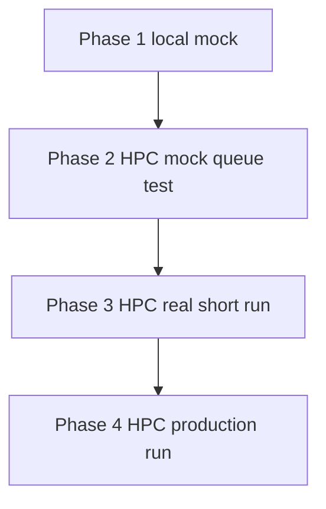
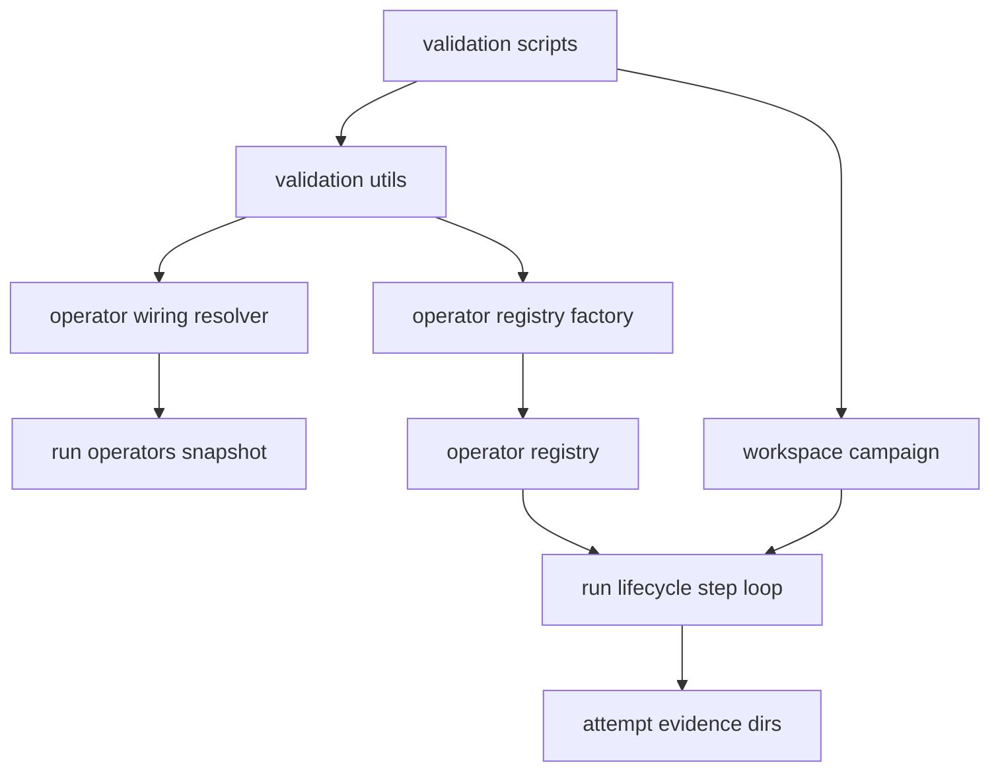

# MXene Shear v2 (mxene_shear_demo_V2) – Alignment Plan for MatterStack v0.2.5 → v0.2.7

**Workspace:** [`workspaces/mxene_shear_demo_V2/`](workspaces/mxene_shear_demo_V2:1)  
**Validation phases:** [`workspaces/mxene_shear_demo_V2/validation/`](workspaces/mxene_shear_demo_V2/validation:1)  
**Primary goal:** Update the MXene Shear v2 workspace + its 4-phase validation harness to align with the latest MatterStack runtime semantics (Attempts, canonical operator keys, and run-persisted operator wiring snapshots) while preserving the *fast iterative debugging workflow* (local → HPC queue test → HPC real test → production).

---

## 1. Where we are at (reports recap)

### v0.2.5 – Attempts + attempt-scoped evidence/workdirs
From [`docs/DevGuides/v0.2.5_Report.md`](docs/DevGuides/v0.2.5_Report.md:1):

- Each logical task (`task_id`) can have multiple **attempts** (`attempt_id`, `attempt_index`).
- Evidence and HPC staging/workdirs become **attempt-scoped**:
  - local: `runs/<run_id>/tasks/<task_id>/attempts/<attempt_id>/...`
  - remote: `<remote_root>/<workspace>/<run_id>/<task_id>/<attempt_id>/...`
- Orchestration loop is attempt-aware (submission/polling/results).
- Evidence export + CLI (`attempts`, `rerun`, `revive`) reflect attempts.

### v0.2.6 – Operator system v2 + canonical operator keys + operators.yaml
From [`docs/DevGuides/v0.2.6_Report.md`](docs/DevGuides/v0.2.6_Report.md:1):

- Routing uses canonical `operator_key` (`kind.name`, e.g. `hpc.default`).
- A multi-instance operator registry is configured via `operators.yaml`.
- Backward compatibility exists (legacy `operator_type=HPC` maps to `hpc.default`), but best practice is to be explicit.

### v0.2.7 – Operator wiring discovery + per-run persisted snapshot
From [`docs/DevGuides/v0.2.7_Report.md`](docs/DevGuides/v0.2.7_Report.md:1):

- Operator wiring now follows precedence and is **snapshotted into the run directory**.
- Default wiring auto-discovery includes `workspaces/<workspace_slug>/operators.yaml`.
- A run’s wiring is **immutable unless forced**, preventing silent drift across resumes:
  - persisted snapshot under `operators_snapshot/` in the run root
  - controlled override via `--force-wiring-override`

---

## 2. Current state of mxene_shear_demo_V2 (what is “out of date”)

### 2.1 Validation harness uses legacy registry keys and bypasses operators.yaml
In [`setup_hpc_with_config()`](workspaces/mxene_shear_demo_V2/validation/validation_utils.py:26), the registry is currently:

- `"HPC": ComputeOperator(...)`
- `"Local": ComputeOperator(...)`
- `"Human": HumanOperator()`
- `"Experiment": ExperimentOperator()`

This is *pre-v0.2.6 style* (operator registry keyed by legacy types), and it bypasses v0.2.6 `operators.yaml` and v0.2.7 run-persisted wiring snapshots.

### 2.2 Workspace driver also manually wires operators
In [`setup_hpc_operator()`](workspaces/mxene_shear_demo_V2/main.py:39) and the execution loop in [`run_custom_loop()`](workspaces/mxene_shear_demo_V2/main.py:74), the workspace similarly injects a legacy-style registry directly into [`step_run()`](matterstack/orchestration/run_lifecycle.py:181).

### 2.3 Evidence locations in historical runs show legacy layout
The workspace contains run artifacts under `runs/<run_id>/operators/hpc/<uuid>/...` (see the directory listing result). This indicates older operator evidence layout, not attempt-scoped layout.

Even though MatterStack now supports compatibility, MXene validation should explicitly validate the *new canonical attempt-scoped artifacts* so reruns/resumes are safe during iterative debugging.

### 2.4 Pipeline data passing between stages likely needs hardening
In [`MxeneShearV2Campaign.plan()`](workspaces/mxene_shear_demo_V2/campaign.py:70), the code stores a path string to an output file from one task and then later does `Path(equil_file)` when building the next task (e.g. READY_CALIB). This likely needs to be updated to ensure that the *actual file contents* are staged into the downstream task’s `files` map (rather than passing a `Path` object).

This matters more under attempt-scoped evidence because there are more candidate paths (attempt history) and we want deterministic behavior.

---

## 3. Desired end state (acceptance criteria)

### 3.1 Validation flows (4 phases) still exist and remain the primary workflow
We keep the 4-phase scripts:

- [`1_local_mock.py`](workspaces/mxene_shear_demo_V2/validation/1_local_mock.py:1)
- [`2_hpc_mock_atesting.py`](workspaces/mxene_shear_demo_V2/validation/2_hpc_mock_atesting.py:1)
- [`3_hpc_real_atesting.py`](workspaces/mxene_shear_demo_V2/validation/3_hpc_real_atesting.py:1)
- [`4_hpc_prod_amilan.py`](workspaces/mxene_shear_demo_V2/validation/4_hpc_prod_amilan.py:1)

…but internally they should align with the v0.2.5/0.2.6/0.2.7 model.

### 3.2 Canonical operator wiring + run snapshot persistence is exercised in MXene runs
For each validation phase run:

- Run root contains `operators_snapshot/` files (snapshot + metadata + history).
- Resuming a run requires **no wiring flags**, and uses the persisted snapshot.

### 3.3 Attempt-scoped evidence is the authoritative artifact location
For each task attempt, we can observe:

- local attempt evidence dir exists and contains `manifest.json`, `submit.sh`, `stdout.log`, `stderr.log`, and outputs (e.g., `equil.restart`).
- the campaign reads outputs deterministically from the attempt-scoped download locations.

### 3.4 Operator routing is explicit and stable
MXene tasks should route through canonical `operator_key` in a predictable way:

- local mock should route to `local.default`
- HPC phases should route to `hpc.atesting` (for phase 2/3) or `hpc.amilan` (for phase 4), or another explicit mapping if we choose a different naming convention.

### 3.5 Iterative debugging support is first-class
During development, we can:

- “fire and forget” submit using detach behavior (phase 4)
- resume runs without re-specifying wiring
- rerun a stage without deleting run state, producing a new attempt (v0.2.5 semantics)

---

## 4. Target architecture for MXene validation harness

### 4.1 High-level flow

### 4.2 Components and responsibilities

Key requirement: the MXene scripts should *stop constructing ad-hoc registries* and instead rely on the same wiring/snapshot behavior as MatterStack CLI (via the resolver and the `operators.yaml` model).

---

## 5. Proposed design changes (brainstorming → decision points)

### Option A (recommended): Add `operators.yaml` to the workspace and have validation scripts use v0.2.7 wiring resolution
- Add a workspace default operators config at:
  - `workspaces/mxene_shear_demo_V2/operators.yaml`
- Update validation harness to:
  - resolve wiring via [`resolve_operator_wiring()`](matterstack/config/operator_wiring.py:1)
  - build registry from snapshot operators.yaml (using the same config parser/registry factory used elsewhere)

**Pros**
- Aligns with v0.2.7 “discoverable by default” goal.
- Resumes become zero-flag by construction.
- Avoids duplicating backend construction logic in multiple scripts.

**Cons**
- Requires designing the `operators.yaml` entries for local + atesting + amilan and deciding how tasks pick a specific HPC operator instance.

### Option B: Keep the “manual registry injection” approach but modernize keys to canonical keys
- Keep injecting `operator_registry` into `step_run`, but:
  - key it by canonical keys (`hpc.default`, `local.default`, `human.default`, `experiment.default`)
  - ensure attempt evidence layout is used and validated

**Pros**
- Smaller initial refactor.

**Cons**
- Still bypasses v0.2.7 wiring snapshot persistence, unless we additionally persist snapshots ourselves.
- Higher drift risk versus the standard config-driven path.

**Decision:** Option A is the target.

---

## 6. Concrete implementation plan (end-to-end)

### 6.1 Add operators configuration (workspace defaults)
Create `workspaces/mxene_shear_demo_V2/operators.yaml` with:

- `local.default` (local backend)
- `human.default` (human operator)
- `experiment.default` (experiment operator)
- Two HPC instances, either:
  - `hpc.atesting` and `hpc.amilan`
  - or `hpc.default` plus `hpc.prod`

Implementation detail: use the existing HPC YAML configs via the `hpc_yaml` adapter described in v0.2.6:
- [`HPC_atesting_config.yaml`](workspaces/mxene_shear_demo_V2/HPC_atesting_config.yaml:1)
- [`HPC_amilan128c_lammps_config.yaml`](workspaces/mxene_shear_demo_V2/HPC_amilan128c_lammps_config.yaml:1)

### 6.2 Update MXene validation utils to use wiring resolver + registry factory
Refactor [`run_validation_pipeline()`](workspaces/mxene_shear_demo_V2/validation/validation_utils.py:60):

- Remove manual SlurmBackend/ComputeOperator construction (`setup_hpc_with_config`).
- Instead:
  - call the v0.2.7 resolver so the run gets `operators_snapshot/` persisted
  - build registry from the resolved snapshot path

Also ensure the pipeline selection logic (atesting vs amilan) is expressed as either:
- selecting an operator instance by `operator_key` (preferred), or
- selecting a different operators config for phase 4 (acceptable, since validation scripts always create a fresh run; no override conflict).

### 6.3 Update workspace driver (main.py) to align with the same wiring model
Refactor [`workspaces/mxene_shear_demo_V2/main.py`](workspaces/mxene_shear_demo_V2/main.py:1) to stop bypassing v0.2.7 wiring:
- If a user runs the workspace directly, the driver should:
  - auto-discover `operators.yaml`
  - persist snapshot into the run root
  - pass the registry into the orchestration loop

### 6.4 Make task routing explicit (operator_key)
Audit how compute tasks choose operator today:

- [`TaskBuilder.build_equilibration()`](workspaces/mxene_shear_demo_V2/src/tasks/builder.py:65) creates tasks without explicitly setting operator fields.

We will align task routing so phases can deterministically select:
- Phase 1: `local.default`
- Phase 2: `hpc.atesting`
- Phase 3: `hpc.atesting`
- Phase 4: `hpc.amilan`

This may require:
- adding `operator_key` into task metadata (depending on the `Task` model fields)
- or introducing a campaign-level “default compute operator key” in `simulation_config.json` and having TaskBuilder populate the Task accordingly

### 6.5 Fix cross-stage artifact passing
In [`MxeneShearV2Campaign.plan()`](workspaces/mxene_shear_demo_V2/campaign.py:70):

- Ensure that when a downstream task needs `equil.restart` or `calibration.json`, the content is staged correctly into the new task’s `files` mapping.
- Prefer using the attempt-scoped artifact path returned by `files` in analyze results, and read file contents into task `files`.

Acceptance test:
- After `equil_50` completes, `calib_50` starts and successfully finds `equil.restart` in its working directory.

### 6.6 Keep the iterative validation knobs
Preserve the validation intent:

- Phase 1: local mock, shortest possible runtime, no Slurm
- Phase 2: HPC mock, smallest resources and shortest walltime, tests SSH, sbatch, downloads
- Phase 3: HPC real atesting, extremely short walltime, validates LAMMPS modules and `mpirun lmp_mpi` path
- Phase 4: HPC production, full resources, detach support

### 6.7 Add validation assertions (automated + manual)
Add a lightweight local validation check script (or extend validation scripts) to assert:

- `operators_snapshot/metadata.json` exists for new runs (v0.2.7)
- attempt evidence directory exists for `equil_50` attempt #1 (v0.2.5)
- attempt record has an operator_key set (v0.2.6)
- the pipeline can proceed Equil → Calib → Sweep without manual intervention (happy-path)

---

## 7. Risks / pitfalls to anticipate

1. **Mixed legacy vs canonical keys**
   - The repo currently supports compatibility, but MXene should not rely on it long-term.
2. **Overriding wiring on resume**
   - With v0.2.7, overriding an existing run’s wiring requires force; validation scripts should avoid confusion by always starting a new run per phase.
3. **Artifact path ambiguity across attempts**
   - Campaign analyze must clearly select *current attempt* outputs, not “some prior file path”.
4. **MPI tasks mismatch**
   - `run_calibration.py` reads `SLURM_NTASKS` while `run_equilibration.py` currently does not pass `-np` unless coded; ensure the actual MPI count used is consistent with the intended Slurm allocation.

---

## 8. Milestones / deliverables (what “done” looks like)

### Milestone 1: Wiring and snapshots integrated
- Workspace has `operators.yaml`
- All 4 validation scripts run using v0.2.7 wiring snapshot persistence

### Milestone 2: Attempt-scoped evidence validated
- Attempt evidence directories are created and used in MXene runs
- Rerun creates a new attempt without overwriting

### Milestone 3: Full pipeline reliable (mock → real → prod)
- Phase 1 completes quickly and deterministically
- Phase 2 validates Slurm submission and downloads
- Phase 3 validates LAMMPS run path correctness at small scale
- Phase 4 runs production settings with detach/resume working cleanly

---

## 9. Immediate next actions (what we should implement first)

1. Create `operators.yaml` for the workspace and decide naming for atesting vs amilan operator instances.
2. Refactor validation utils to stop building manual operator registries; instead use operator wiring resolver + registry factory.
3. Update task routing defaults and/or TaskBuilder to explicitly select operator_key per phase.
4. Fix cross-stage artifact passing (equil.restart and calibration.json).
5. Run through the 4 phases and confirm each milestone with evidence artifacts and logs.

---

## 10. Notes on preserving the developer workflow

- Keep the 4-phase scripts as the canonical development workflow.
- Keep “phase 2” queue tests extremely lightweight so we can iterate without long waits.
- Use “phase 3” for end-to-end real LAMMPS execution sanity checks, not for production science runs.
- Reserve “phase 4” for production and add guardrails:
  - detach mode for submission
  - explicit resume instructions
  - clear evidence export per run for audit
