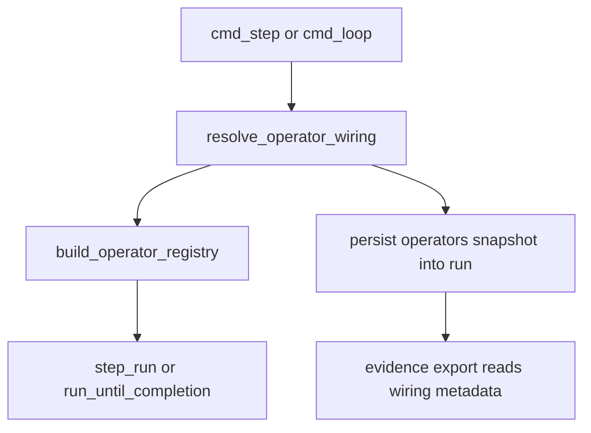

# MatterStack v0.2.7 Report – Operator Wiring Discovery + Run-Persisted Provenance

This report tracks work completed for v0.2.7. The corresponding design guide is [`docs/DevGuides/DevGuide_v0.2.7.md`](docs/DevGuides/DevGuide_v0.2.7.md:1).

---

## Subtask 1 – Operator Wiring Resolution Architecture + Report Bootstrapping

### Status
- **State:** COMPLETE (architecture + plan)
- **Scope:** Architecture, interfaces, precedence rules, persistence layout, diagnostics/evidence integration plan.
- **Implementation:** Deferred to Code mode (later subtasks).

### Problem recap (v0.2.6 pain)
In v0.2.6, operator wiring is correct architecturally (campaigns pick canonical keys; wiring comes from CLI/runtime), but operationally awkward because users repeatedly pass `--operators-config` and resume wiring can drift.

v0.2.7 goal: wiring should be discoverable by default and persisted per-run (snapshot + hash + provenance), so resuming requires no flags and provenance is explicit and immutable.

Primary upstream design reference: [`docs/DevGuides/DevGuide_v0.2.7.md`](docs/DevGuides/DevGuide_v0.2.7.md:1).

---

## Architecture brainstorming (multiple approaches)

### Approach A (selected): filesystem snapshot + metadata (no DB schema bump)
**Summary:** Resolve an operators config path using precedence rules, compute a hash, and persist an immutable snapshot + metadata under the run root directory.

- **Pros**
  - No SQLite schema change needed (low-risk, fast to ship).
  - Aligns with file-based evidence philosophy in [`docs/evidence_bundles.md`](docs/evidence_bundles.md:1).
  - Resumes can rely only on run directory contents.
- **Cons**
  - Cross-run querying requires filesystem scanning (acceptable for v0.2.7).
  - Need careful “override safety” to avoid silent drift.

### Approach B: DB-backed run input provenance (schema bump)
**Summary:** Add schema v4 to store wiring hash + snapshot pointers in SQLite (possibly as a `run_inputs` table) and make evidence/diagnostics read from DB.

- **Pros**
  - Queryable across runs; provenance is centralized.
- **Cons**
  - Migration complexity and higher blast-radius for v0.2.7.
  - Still needs filesystem snapshot for portability unless we store full bytes in DB.

**Decision:** implement Approach A in v0.2.7, while keeping a clean API boundary so Approach B can be layered later.

---

## Selected architecture: Unified Operator Wiring Resolver (v0.2.7)

### New module + responsibility boundary
Introduce a single resolver module: [`matterstack/config/operator_wiring.py`](matterstack/config/operator_wiring.py:1)

Responsibilities:
- Resolve the effective operators wiring source + path (precedence below).
- Compute stable sha256 of canonical bytes.
- Persist snapshot + metadata into run directory (first resolution) for zero-flag resumes.
- Enforce override safety (refuse unless forced; audit when forced).
- Expose a single `ResolvedOperatorWiring` object that downstream systems use for:
  - building the operator registry
  - evidence export provenance
  - diagnostics/explain output

### Precedence rules (v0.2.7 canonical)
From highest priority to lowest priority:

1. CLI override: [`--operators-config`](matterstack/cli/main.py:712)
2. Run-persisted snapshot (inside run root, described below)
3. Workspace default: `workspaces/<workspace_slug>/operators.yaml`
4. Env var: `MATTERSTACK_OPERATORS_CONFIG`
5. Legacy fallback (only if no operators config is resolved): `--hpc-config` / `--profile` (compat adapter)

Key policy: **no silent drift**. If a run already has persisted wiring, it wins over workspace defaults/env vars; CLI can override only when explicitly forced.

---

## Resolver API specification (v0.2.7)

### Types
- [`OperatorWiringSource`](matterstack/config/operator_wiring.py:1) (enum)
  - `CLI_OVERRIDE`
  - `RUN_PERSISTED`
  - `WORKSPACE_DEFAULT`
  - `ENV_VAR`
  - `LEGACY_PROFILE`
  - `LEGACY_HPC_CONFIG`
  - `NONE` (nothing resolved; legacy-less)

- [`ResolvedOperatorWiring`](matterstack/config/operator_wiring.py:1) (dataclass, frozen)
  - `source: OperatorWiringSource`
  - `resolved_path: Optional[str]`
    Absolute filesystem path to the operators config that was used to produce the snapshot (or to the generated snapshot).
  - `sha256: Optional[str]`
    sha256 of canonical bytes used for the effective wiring.
  - `snapshot_path: Optional[str]`
    Absolute path under the run root where the snapshot lives.
  - `metadata_path: str`
    Absolute path to run metadata JSON file (exists after persist).
  - `history_path: str`
    Absolute path to append-only history log (exists after persist).
  - `is_persisted: bool`
    Whether run snapshot is present and consistent.
  - `override_blocked: bool`
    True when user attempted override but was refused (used for error formatting upstream).
  - `warnings: list[str]`

### Entry-point function signatures
- [`resolve_operator_wiring()`](matterstack/config/operator_wiring.py:1)

Inputs:
- `run_handle: RunHandle` (for `run_id`, `workspace_slug`, `root_path`)
- `workspace_slug: Optional[str]` (default from run_handle; allows init-time use before handle exists, if needed)
- `cli_operators_config: Optional[str]`
- `cli_force_wiring_override: bool`
- `cli_config_path: Optional[str]` (profiles config; required for profile-based backends)
- `cli_profile: Optional[str]` (legacy)
- `cli_hpc_config: Optional[str]` (legacy)
- `env: Mapping[str, str]` (default `os.environ`)
- `workspace_root: Optional[Path]` (optional override for tests)
- `persist: bool = True` (can be disabled for “dry resolve” in help/explain)

Outputs:
- `ResolvedOperatorWiring`

Errors:
- `FileNotFoundError` when an explicit path is provided (CLI/env) but does not exist.
- `ValueError` when both operators config *and* legacy flags are provided (ambiguous intent), or when override is attempted without force.
- `RuntimeError` for unexpected IO failures writing snapshot/metadata.

---

## Run-level persistence layout + schema (v0.2.7)

### Directory layout under run root
Under `run_handle.root_path`, persist:

- `operators_snapshot/`
  - `operators.yaml` (the effective snapshot used by the run)
  - `metadata.json` (current snapshot metadata; rewritten on update)
  - `history.jsonl` (append-only audit log; never rewritten)

All paths above are relative to the run root for portability.

### `metadata.json` schema (current snapshot)
File: `operators_snapshot/metadata.json`

```json
{
  "schema_version": 1,
  "created_at_utc": "2025-12-14T21:00:00Z",
  "updated_at_utc": "2025-12-14T21:05:00Z",
  "effective": {
    "source": "RUN_PERSISTED",
    "resolved_path": "/abs/path/to/operators.yaml",
    "sha256": "hex",
    "snapshot_relpath": "operators_snapshot/operators.yaml"
  },
  "provenance": {
    "workspace_slug": "my_workspace",
    "env_var_name": "MATTERSTACK_OPERATORS_CONFIG",
    "cli": {
      "operators_config": "/abs/path/or/null",
      "force_wiring_override": false
    },
    "legacy": {
      "profile": null,
      "hpc_config": null,
      "profiles_config_path": null
    }
  },
  "history_relpath": "operators_snapshot/history.jsonl"
}
```

Notes:
- `effective.snapshot_relpath` is the authoritative “resume source” (the run’s wiring).
- `resolved_path` records the external origin (for audit), but resumes must not require it.

### `history.jsonl` schema (append-only events)
File: `operators_snapshot/history.jsonl`

Each line is a JSON object:

```json
{
  "at_utc": "2025-12-14T21:05:00Z",
  "event": "WIRING_PERSISTED",
  "source": "WORKSPACE_DEFAULT",
  "sha256": "hex",
  "resolved_path": "/abs/path/or/null",
  "snapshot_relpath": "operators_snapshot/operators.yaml",
  "details": {
    "note": "Initial persistence"
  }
}
```

Additional events:
- `WIRING_OVERRIDE_REFUSED` (no snapshot change)
- `WIRING_OVERRIDE_FORCED` (snapshot replaced; record prior hash in details)
- `WIRING_RESOLVED_NO_PERSIST` (when `persist=False`)

### Idempotency rules
- If snapshot exists and sha256 matches requested effective wiring: do not rewrite snapshot; optionally append a `WIRING_RESOLVED_NOOP` history event (optional).
- If snapshot exists and differs:
  - Without `--force-wiring-override`: refuse with a deterministic error.
  - With force: replace `operators_snapshot/operators.yaml` and update metadata; append `WIRING_OVERRIDE_FORCED`.

---

## Override safety model (v0.2.7)
User decision (confirmed): use env var `MATTERSTACK_OPERATORS_CONFIG`; **default override policy is refusal unless forced**.

Policy:
- If run already has persisted wiring:
  - CLI `--operators-config` is an override attempt.
  - If `--force-wiring-override` is not set: fail fast with error that includes:
    - persisted sha256
    - attempted sha256 (if file readable)
    - instruction to re-run with `--force-wiring-override` if intentional.
  - If forced: snapshot is replaced and an audit event is appended.

---

## CLI + runtime integration plan (call graph / data-flow)

### Current v0.2.6 flow (baseline)
- [`cmd_step()`](matterstack/cli/main.py:50) and [`cmd_loop()`](matterstack/cli/main.py:111) call:
  - [`build_operator_registry()`](matterstack/cli/operator_registry.py:135) with `RegistryConfig(operators_config_path=..., profile=..., hpc_config_path=...)`
  - then pass `operator_registry` into [`step_run()`](matterstack/orchestration/run_lifecycle.py:1)

### v0.2.7 flow (target)
Resolver sits in front of registry construction.



Concrete integration points:
1. Update [`cmd_step()`](matterstack/cli/main.py:50) and [`cmd_loop()`](matterstack/cli/main.py:111):
   - call [`resolve_operator_wiring()`](matterstack/config/operator_wiring.py:1)
   - if it returns `snapshot_path`, pass that as `RegistryConfig.operators_config_path`
   - do **not** pass legacy flags into [`build_operator_registry()`](matterstack/cli/operator_registry.py:135) when resolver has produced an operators snapshot (to avoid the “cannot combine” error in [`RegistryConfig`](matterstack/cli/operator_registry.py:18))
2. Update CLI parser in [`main()`](matterstack/cli/main.py:696) (v0.2.7 planned):
   - add `--force-wiring-override` to `step` and `loop`
   - optionally add `--operators-config` to `init` (as described in [`docs/DevGuides/DevGuide_v0.2.7.md`](docs/DevGuides/DevGuide_v0.2.7.md:125))
3. Update operator registry:
   - no change in operator construction logic is required beyond feeding it the resolved snapshot path
   - caching in [`get_cached_operator_registry_from_operators_config()`](matterstack/runtime/operators/registry.py:179) remains valid because snapshot path is stable and under run root

### Legacy fallback handling (no operators.yaml available)
If no operators config is resolved from CLI/run/workspace/env:
- resolver checks legacy `--hpc-config` / `--profile` inputs
- if present, resolver generates an equivalent `operators.yaml` snapshot under run root:
  - includes at least `hpc.default`, `local.default`, `human.default`, `experiment.default`
  - uses backend type `hpc_yaml` or `profile` as supported by [`matterstack/runtime/operators/registry.py`](matterstack/runtime/operators/registry.py:121)
- return `source=LEGACY_*` and `snapshot_path=<run>/operators_snapshot/operators.yaml`
- downstream uses the normal operators.yaml-based registry path

This preserves compatibility but still gives v0.2.7 provenance and zero-flag resume behavior.

---

## Evidence export + diagnostics consumption plan

### Evidence export
Add operator wiring provenance into the evidence bundle produced by [`build_evidence_bundle()`](matterstack/storage/export.py:60), and ensure it is serialized in [`export_evidence_bundle()`](matterstack/storage/export.py:228).

Proposed shape (inside `EvidenceBundle.data`):
- `data["operator_wiring"] = { "sha256": "...", "source": "...", "snapshot_relpath": "...", "metadata_relpath": "..." }`

Also extend report rendering in [`_generate_markdown_report()`](matterstack/storage/export.py:252) to include the wiring hash + snapshot path.

### Diagnostics / explain
Extend CLI explain command (implemented around [`cmd_explain`](matterstack/cli/main.py:776) and frontier data in [`get_run_frontier()`](matterstack/orchestration/diagnostics.py:48)) to display:
- run wiring hash
- wiring source
- snapshot relative path

This complements per-attempt routing shown by `operator_key` (already resolved in diagnostics via [`resolve_operator_key_for_attempt()`](matterstack/orchestration/diagnostics.py:7)).

---

## Validation plan (tests + exit criteria)

### Unit tests
New unit tests for [`resolve_operator_wiring()`](matterstack/config/operator_wiring.py:1):
- precedence order correctness (CLI > run > workspace > env > legacy)
- snapshot persistence creates `operators_snapshot/operators.yaml`, `metadata.json`, `history.jsonl`
- sha256 stability (same bytes => same hash)
- override refusal when run snapshot exists and `--force-wiring-override` not set
- forced override updates snapshot + appends audit entry
- error on missing explicit path (CLI/env)
- legacy generation creates a valid operators.yaml that builds a registry

### Integration / e2e tests
Extend existing e2e that already exercises operators config persistence/export:
- [`tests/e2e/test_cli_operators_config_routing_persistence_export.py`](tests/e2e/test_cli_operators_config_routing_persistence_export.py:1)

New scenarios:
1. run `step` with `--operators-config` once → snapshot exists
2. run `step` again without flags → uses run-persisted snapshot
3. run `export-evidence` → evidence includes wiring provenance
4. run `explain` → prints wiring provenance

Exit criteria for implementation phase:
- zero-flag resume works deterministically after first persistence
- overriding a run’s persisted wiring is refused unless forced
- evidence export and diagnostics surface wiring provenance
- unit + integration tests pass

---

## Ordered implementation To-Do list (for Code mode execution)

1. Add new resolver module scaffold: [`matterstack/config/operator_wiring.py`](matterstack/config/operator_wiring.py:1)
   - Acceptance: module defines [`OperatorWiringSource`](matterstack/config/operator_wiring.py:1), [`ResolvedOperatorWiring`](matterstack/config/operator_wiring.py:1), and [`resolve_operator_wiring()`](matterstack/config/operator_wiring.py:1) with docstring specifying precedence + semantics.

2. Implement run snapshot persistence helpers in [`resolve_operator_wiring()`](matterstack/config/operator_wiring.py:1)
   - Acceptance: snapshot + metadata + history files are written under `<run_root>/operators_snapshot/` with idempotency.

3. Implement precedence resolution logic in [`resolve_operator_wiring()`](matterstack/config/operator_wiring.py:1)
   - Acceptance: correct selection among CLI/run/workspace/env/legacy and deterministic error messages.

4. Implement override refusal + forced override (`--force-wiring-override`)
   - Acceptance: mismatch without force raises, mismatch with force replaces snapshot and appends `WIRING_OVERRIDE_FORCED` event.

5. Wire resolver into CLI `step` and `loop`: [`matterstack/cli/main.py`](matterstack/cli/main.py:50)
   - Acceptance: both codepaths build registry from `ResolvedOperatorWiring.snapshot_path` and no longer require `--operators-config` after first run.

6. Add CLI flag parsing for `--force-wiring-override`: [`main()`](matterstack/cli/main.py:696)
   - Acceptance: flag is available on `step` and `loop` and forwarded to resolver.

7. (Optional but recommended) Extend `init` to accept `--operators-config`: [`main()`](matterstack/cli/main.py:700)
   - Acceptance: `init` can persist wiring immediately; if omitted, workspace default discovery persists when available.

8. Update evidence export to include wiring provenance: [`matterstack/storage/export.py`](matterstack/storage/export.py:60)
   - Acceptance: `bundle.json` contains `operator_wiring` fields and markdown report includes wiring hash.

9. Update explain/diagnostics output to show wiring provenance: [`matterstack/orchestration/diagnostics.py`](matterstack/orchestration/diagnostics.py:48) (and CLI explain)
   - Acceptance: explain output includes wiring hash/source/snapshot relpath.

10. Add unit tests for resolver
   - Acceptance: unit tests cover precedence, persistence, override safety, and legacy generation.

11. Add/extend integration/e2e tests for zero-flag resume + evidence/diagnostics
   - Acceptance: end-to-end CLI scenario passes and asserts snapshot presence + evidence contents.

---

### Subtask 1 completion statement
- Report scaffold created at [`docs/DevGuides/v0.2.7_Report.md`](docs/DevGuides/v0.2.7_Report.md:1).
- Subtask 1 architecture + plan recorded here; implementation is deferred to Code mode.

---

## Subtask 2 – Resolver + CLI Integration

### Status
- **State:** COMPLETE (resolver + CLI `step`/`loop` wiring integration + override safety + snapshot persistence)
- **Scope:** Implement operator wiring resolver and integrate it into CLI execution entrypoints, persisting per-run wiring snapshots so resumes no longer require `--operators-config`.

### What was implemented

#### 1) Unified operator wiring resolver module
Added [`matterstack/config/operator_wiring.py`](matterstack/config/operator_wiring.py:1) providing:
- [`OperatorWiringSource`](matterstack/config/operator_wiring.py:1) enum
- [`ResolvedOperatorWiring`](matterstack/config/operator_wiring.py:1) dataclass
- [`resolve_operator_wiring()`](matterstack/config/operator_wiring.py:1) entrypoint

This module is the single place that:
- resolves wiring by precedence,
- enforces override safety,
- persists wiring snapshots under the run root, and
- returns the snapshot path used for registry construction.

#### 2) Run snapshot persistence (idempotent)
Resolver persists wiring snapshots under:

- `<run_root>/operators_snapshot/operators.yaml`
- `<run_root>/operators_snapshot/metadata.json`
- `<run_root>/operators_snapshot/history.jsonl` (append-only audit log)

The resolver is idempotent:
- If the requested effective wiring bytes hash to the same sha256 as the existing snapshot, the snapshot file is not rewritten.
- If it differs, override safety rules apply (below).

#### 3) Precedence resolution (exact order)
Precedence is implemented exactly as specified:

1. CLI `--operators-config`
2. Run snapshot (`<run_root>/operators_snapshot/operators.yaml`)
3. Workspace default `workspaces/<workspace_slug>/operators.yaml`
4. Env var `MATTERSTACK_OPERATORS_CONFIG`
5. Legacy fallback (`--hpc-config` / `--profile`) **implemented by generating a minimal `operators.yaml` snapshot** so even legacy users get zero-flag resume behavior.

Missing explicit paths are deterministic errors:
- If `--operators-config` points to a missing file, or env var `MATTERSTACK_OPERATORS_CONFIG` points to a missing file, the resolver raises `FileNotFoundError`.

#### 4) Override safety (+ audit)
If a run already has a persisted snapshot and the user supplies CLI `--operators-config`:
- **Refuse by default** unless `--force-wiring-override` is set.
- Refusals and forced overrides are recorded in `<run_root>/operators_snapshot/history.jsonl`.
- Forced overrides replace `<run_root>/operators_snapshot/operators.yaml` and update `metadata.json`.

### CLI integration (step/loop)
Updated [`matterstack/cli/main.py`](matterstack/cli/main.py:1) so that:

- [`cmd_step()`](matterstack/cli/main.py:50) and single-run [`cmd_loop()`](matterstack/cli/main.py:111):
  - call [`resolve_operator_wiring()`](matterstack/config/operator_wiring.py:1) before building the operator registry
  - pass `ResolvedOperatorWiring.snapshot_path` into [`build_operator_registry()`](matterstack/cli/operator_registry.py:135) via `RegistryConfig.operators_config_path`
  - avoid passing legacy flags to [`build_operator_registry()`](matterstack/cli/operator_registry.py:135) when a snapshot exists (including legacy-generated snapshots), to preserve the “cannot combine” semantics in [`RegistryConfig`](matterstack/cli/operator_registry.py:18)

- Multi-run scheduler mode (`matterstack loop` without a `run_id`):
  - does **not** apply a global `--operators-config` override across runs (per Subtask 2 decision)
  - resolves wiring per-run (run snapshot > workspace default > env var > legacy)

### Manual validation recipe (no tests required in this subtask)

#### A) Validate “first step persists; second step needs no flag” (legacy path)
This repo may not include a ready-made `operators.yaml` in `workspaces/`. You can validate using legacy flags (which now generate a snapshot automatically):

1. Initialize a run:
   - `python -m matterstack.cli.main init <workspace_slug>`

2. First tick: run a step with legacy wiring (this will persist `<run_root>/operators_snapshot/`):
   - `python -m matterstack.cli.main step <run_id> --profile <profile_name> --config <profiles_yaml_path>`
   - OR: `python -m matterstack.cli.main step <run_id> --hpc-config <legacy_hpc_yaml_path>`

3. Confirm snapshot files exist under the run directory:
   - `operators_snapshot/operators.yaml`
   - `operators_snapshot/metadata.json`
   - `operators_snapshot/history.jsonl`

4. Second tick: run a step with **no wiring flags**:
   - `python -m matterstack.cli.main step <run_id>`

Expected: second step succeeds using the run snapshot (no `--operators-config` required).

#### B) Validate override refusal / forced override (explicit operators.yaml path)
1. First tick (persist from explicit operators.yaml):
   - `python -m matterstack.cli.main step <run_id> --operators-config /path/to/operators.yaml`

2. Attempt to override without force (should fail):
   - `python -m matterstack.cli.main step <run_id> --operators-config /path/to/other_operators.yaml`

3. Force override (should succeed and update snapshot):
   - `python -m matterstack.cli.main step <run_id> --operators-config /path/to/other_operators.yaml --force-wiring-override`

Expected:
- The refusal writes a `WIRING_OVERRIDE_REFUSED` event to `history.jsonl`.
- The forced override writes `WIRING_OVERRIDE_FORCED` and updates `metadata.json`.

---

## Subtask 3 – Evidence Export Wiring Provenance

### Status
- **State:** COMPLETE
- **Scope:** Evidence bundle JSON + evidence export directory + evidence report surface run-level operator wiring provenance (snapshot hash/source/path), with graceful behavior for older runs that do not have an `operators_snapshot/` directory.

### What changed

#### 1) Evidence bundle JSON now includes run-level operator wiring provenance
Updated [`build_evidence_bundle()`](matterstack/storage/export.py:60) to attach an `operator_wiring` section under `EvidenceBundle.data`, alongside `tasks`:

- `data["operator_wiring"] = { ... }`

The provenance is read from the run snapshot metadata file when present:
- `<run_root>/operators_snapshot/metadata.json` (schema defined/maintained by [`_write_metadata()`](matterstack/config/operator_wiring.py:100))

Minimum fields included in exported `bundle.json`:
- `source`
- `sha256`
- `snapshot_relpath`
- `resolved_path` (when present in metadata)
- `created_at_utc` (when present in metadata)

Notes:
- This is a **non-breaking** change because it only adds a new key under `data` (no top-level schema bump in [`EvidenceBundle`](matterstack/core/evidence.py:8)).
- When the snapshot directory/metadata is missing, the exporter records `"source": "UNKNOWN"` and leaves the rest as `null`.

#### 2) Evidence export embeds the operator wiring snapshot files
Updated [`export_evidence_bundle()`](matterstack/storage/export.py:228) to copy the run snapshot files into the evidence directory (best-effort):

From run:
- `<run_root>/operators_snapshot/operators.yaml`
- `<run_root>/operators_snapshot/metadata.json`
- `<run_root>/operators_snapshot/history.jsonl` (optional)

Into evidence:
- `<run_root>/evidence/operators_snapshot/operators.yaml`
- `<run_root>/evidence/operators_snapshot/metadata.json`
- `<run_root>/evidence/operators_snapshot/history.jsonl` (if present)

Backwards compatibility:
- If `<run_root>/operators_snapshot/` does not exist, evidence export still succeeds and simply omits these files.

#### 3) Evidence markdown report now surfaces operator wiring provenance
Updated [`_generate_markdown_report()`](matterstack/storage/export.py:252) to add an “Operator Wiring” section which includes:
- source (e.g. `RUN_PERSISTED`, `CLI_OVERRIDE`, etc.)
- sha256
- run snapshot relative path
- resolved/origin path (if recorded)
- created_at_utc (if recorded)

The report also references the files copied into:
- `evidence/operators_snapshot/operators.yaml`
- `evidence/operators_snapshot/metadata.json`
- `evidence/operators_snapshot/history.jsonl` (if present)

### Validation performed

- Targeted validation was performed by running evidence export with and without a run-level `operators_snapshot/` directory to confirm:
  - evidence export succeeds in both cases,
  - `bundle.json` includes `data.operator_wiring`,
  - and snapshot files are copied into `evidence/operators_snapshot/` when present.

(See Subtask 3 implementation in [`matterstack/storage/export.py`](matterstack/storage/export.py:1).)

### Backward-compat / schema considerations

- Evidence export remains compatible with older runs that do not have `operators_snapshot/`:
  - `operator_wiring` is present but populated with `"UNKNOWN"`/`null` values, and no snapshot files are copied.
- No changes were required to persisted DB schema ([`matterstack/storage/schema.py`](matterstack/storage/schema.py:1)).

---

## Subtask 4 – Tests & Validation

### Status
- **State:** COMPLETE
- **Scope:** Add automated coverage for operator wiring resolver precedence/persistence/override safety and update E2E CLI regression coverage for run-persisted snapshots + evidence export snapshot artifacts.

### What was added/updated

#### 1) Unit tests: resolver precedence (CLI > run > workspace > env > legacy)
Added [`tests/unit/config/test_operator_wiring_precedence.py`](tests/unit/config/test_operator_wiring_precedence.py:1), covering:
- CLI override wins over workspace default and env var.
- Run snapshot wins over workspace/env/legacy after first persistence.
- Workspace default wins over env and legacy.
- Env var wins over legacy.
- Legacy fallback coverage for **both**:
  - legacy `--profile` → `LEGACY_PROFILE`
  - legacy `--hpc-config` → `LEGACY_HPC_CONFIG`

#### 2) Unit tests: snapshot persistence, idempotency, sha256 stability
Added [`tests/unit/config/test_operator_wiring_persistence.py`](tests/unit/config/test_operator_wiring_persistence.py:1), covering:
- Initial persistence creates `<run_root>/operators_snapshot/operators.yaml`, `metadata.json`, `history.jsonl`
- Idempotency: repeated resolution with identical effective bytes does **not** rewrite the snapshot file (mtime stable)
- sha256 stability: computed sha matches `hashlib.sha256(snapshot_bytes).hexdigest()` and is stable across resolves
- Resilience: if only `operators_snapshot/operators.yaml` exists, resolver reconstructs missing metadata/history

#### 3) Unit tests: override refusal vs forced override (+ audit history)
Added [`tests/unit/config/test_operator_wiring_override_safety.py`](tests/unit/config/test_operator_wiring_override_safety.py:1), covering:
- Override refused without force:
  - raises `ValueError`
  - appends `WIRING_OVERRIDE_REFUSED` to `<run_root>/operators_snapshot/history.jsonl`
  - does not mutate `<run_root>/operators_snapshot/operators.yaml`
- Forced override allowed:
  - replaces `<run_root>/operators_snapshot/operators.yaml`
  - appends `WIRING_OVERRIDE_FORCED` with `prior_sha256`

#### 4) E2E CLI regression: “first step persists; second step needs no flags” + evidence export snapshot artifacts
Updated [`tests/e2e/test_cli_operators_config_routing_persistence_export.py`](tests/e2e/test_cli_operators_config_routing_persistence_export.py:1) to validate:
- First `step --operators-config` persists `<run_root>/operators_snapshot/operators.yaml|metadata.json|history.jsonl`
- Second `step` without wiring flags succeeds (uses run snapshot); test deletes the original external operators file to ensure the run snapshot is truly used
- `export-evidence` copies snapshot artifacts into:
  - `<run_root>/evidence/operators_snapshot/operators.yaml`
  - `<run_root>/evidence/operators_snapshot/metadata.json`
  - `<run_root>/evidence/operators_snapshot/history.jsonl`
- Evidence report mentions the snapshot copy (via the “Copied into this evidence export under:” section)

### Validation commands + outcomes
Executed targeted pytest with mitigation flag:

```bash
MATTERSTACK_PYTEST_STUB_READLINE=1 python -m pytest -q \
  tests/unit/config/test_operator_wiring_precedence.py \
  tests/unit/config/test_operator_wiring_persistence.py \
  tests/unit/config/test_operator_wiring_override_safety.py \
  tests/e2e/test_cli_operators_config_routing_persistence_export.py
```

Result: **12 passed** (with warnings only; no failures).

---

## Subtask 5 – Diagnostics Wiring Provenance

### Status
- **State:** COMPLETE
- **Scope:** Surface run-level operator wiring provenance (source/hash/snapshot relpath) in interactive diagnostics output via `matterstack explain`.

### What changed

#### 1) Diagnostics can read run wiring provenance from run root
Added a small helper in [`matterstack/config/operator_wiring.py`](matterstack/config/operator_wiring.py:1) to read:
- `<run_root>/operators_snapshot/metadata.json`

The helper extracts the fields written by [`_write_metadata()`](matterstack/config/operator_wiring.py:100):
- `effective.source`
- `effective.sha256`
- `effective.snapshot_relpath`

If metadata is missing or malformed, the loader returns `None` so diagnostics can fall back gracefully.

#### 2) `matterstack explain` now prints wiring provenance near the top
Updated [`cmd_explain()`](matterstack/cli/main.py:559) to print one dedicated line immediately after the existing `Run:`/`Status:` lines.

Exact addition (single-line, stable format):
- `Operator wiring: source=..., sha256=..., snapshot=operators_snapshot/operators.yaml`

Fallback behavior (backward compatible; no crash):
- `Operator wiring: none/unknown`

### Files changed
- [`matterstack/config/operator_wiring.py`](matterstack/config/operator_wiring.py:1)
  - Added `metadata.json` loader + stable explain-line formatter.
- [`matterstack/cli/main.py`](matterstack/cli/main.py:559)
  - `explain` now prints the operator wiring provenance line near the top.
- [`tests/unit/core/test_run_explain.py`](tests/unit/core/test_run_explain.py:1)
  - Added minimal coverage asserting wiring provenance appears in formatted output.
- [`docs/DevGuides/v0.2.7_Report.md`](docs/DevGuides/v0.2.7_Report.md:1)
  - Appended this completion section.

### Manual validation
1. Ensure a run has wiring snapshot metadata at:
   - `<run_root>/operators_snapshot/metadata.json`
2. Run:
   - `python -m matterstack.cli.main explain <run_id>`
3. Confirm output includes a line like:
   - `Operator wiring: source=RUN_PERSISTED, sha256=<hex>, snapshot=operators_snapshot/operators.yaml`
4. For an older run without `operators_snapshot/metadata.json`, confirm output includes:
   - `Operator wiring: none/unknown`

### Tests run
Executed targeted unit test with mitigation flag:

```bash
MATTERSTACK_PYTEST_STUB_READLINE=1 python -m pytest -q tests/unit/core/test_run_explain.py
```

Result: **4 passed** (warnings only).

---

## Full Suite Validation (v0.2.7)

Executed full-suite pytest with the agreed test-only mitigation flag (see [`sitecustomize.py`](sitecustomize.py:1)):

```bash
MATTERSTACK_PYTEST_STUB_READLINE=1 python -m pytest
```

Result: **194 passed, 2 skipped, 336 warnings**.

Skipped tests (expected):
- `thin_film_lab` workspace is missing from repo:
  - [`tests/e2e/test_science_validation.py`](tests/e2e/test_science_validation.py:79)
  - [`tests/e2e/test_workflow_execution.py`](tests/e2e/test_workflow_execution.py:105)

---

## Final v0.2.7 Completion Summary

### What v0.2.7 adds (in one sentence)
**Operator wiring no longer needs to be re-specified on every CLI tick**: MatterStack now resolves wiring once, persists an immutable snapshot under the run root, and uses that snapshot for deterministic zero-flag resumes.

### Core deliverables (implemented)
1. **Run-persisted operator wiring snapshot + provenance**
   - Implemented in [`matterstack/config/operator_wiring.py`](matterstack/config/operator_wiring.py:1)
   - Run root layout:
     - `operators_snapshot/operators.yaml`
     - `operators_snapshot/metadata.json`
     - `operators_snapshot/history.jsonl`

2. **CLI `step`/`loop` uses wiring resolver**
   - Implemented in [`matterstack/cli/main.py`](matterstack/cli/main.py:1)
   - Supports `--force-wiring-override` to prevent silent drift.

3. **Evidence export includes wiring provenance and bundles snapshot files**
   - Implemented in [`matterstack/storage/export.py`](matterstack/storage/export.py:1)
   - Evidence contains `operator_wiring` metadata and copied `evidence/operators_snapshot/*`.

4. **Interactive diagnostics show wiring provenance**
   - Implemented in [`cmd_explain()`](matterstack/cli/main.py:559)
   - Displays `Operator wiring: source=..., sha256=..., snapshot=...` (or `none/unknown`).

5. **Automated coverage**
   - Unit tests:
     - [`tests/unit/config/test_operator_wiring_precedence.py`](tests/unit/config/test_operator_wiring_precedence.py:1)
     - [`tests/unit/config/test_operator_wiring_persistence.py`](tests/unit/config/test_operator_wiring_persistence.py:1)
     - [`tests/unit/config/test_operator_wiring_override_safety.py`](tests/unit/config/test_operator_wiring_override_safety.py:1)
   - E2E regression update:
     - [`tests/e2e/test_cli_operators_config_routing_persistence_export.py`](tests/e2e/test_cli_operators_config_routing_persistence_export.py:1)
   - Explain coverage:
     - [`tests/unit/core/test_run_explain.py`](tests/unit/core/test_run_explain.py:1)

### How to use (quick operational summary)
- First tick (pick wiring explicitly once):
  - `matterstack step <run_id> --operators-config /path/to/operators.yaml`
- Subsequent ticks/resume (no wiring flags required):
  - `matterstack step <run_id>`
- Evidence export (includes wiring snapshot):
  - `matterstack export-evidence <run_id>`
- Diagnostics:
  - `matterstack explain <run_id>`

### Known limitations / follow-ups (optional)
- Optional UX enhancement: `matterstack init --operators-config` to persist snapshot at init time (not required because `step/loop` persist on first execution tick).
- Optional: a dedicated “auto-discovery validation workspace” to demonstrate `workspaces/<slug>/operators.yaml` with zero CLI flags end-to-end.

---

## Subtask 6 – init wiring snapshot

### Status
- **State:** COMPLETE
- **Scope:** Add `matterstack init --operators-config` to persist the run’s operator wiring snapshot at init time (before any execution ticks), improving “ready-to-resume” UX and capturing provenance immediately.

### What changed

#### 1) CLI UX: `init` accepts `--operators-config`
Updated argument parsing in [`matterstack/cli/main.py`](matterstack/cli/main.py:731) to support:

- `matterstack init <workspace> --operators-config /path/to/operators.yaml`

The flag uses the same `dest=operators_config` naming and help text as `step`/`loop`.

#### 2) Persist snapshot at init (using the existing resolver)
Updated [`cmd_init()`](matterstack/cli/main.py:40) so that when `--operators-config` is provided, it calls the single source of truth resolver [`resolve_operator_wiring()`](matterstack/config/operator_wiring.py:409) immediately after run creation, which persists:

- `operators_snapshot/operators.yaml`
- `operators_snapshot/metadata.json`
- `operators_snapshot/history.jsonl`

This ensures the run directory is “ready to resume” with no wiring flags before the first `step`/`loop` tick.

#### 3) Safety behavior
`init` now fails deterministically if the explicit `--operators-config` path does not exist (before creating the run directory), keeping behavior simple and predictable for new runs.

### Automated validation

#### E2E coverage
Updated [`tests/e2e/test_cli_operators_config_routing_persistence_export.py`](tests/e2e/test_cli_operators_config_routing_persistence_export.py:151) to assert:
- `init --operators-config` creates snapshot files immediately (before any `step`)
- deleting the original external operators file does not break subsequent `step`/`loop` (run uses `RUN_PERSISTED` snapshot)

#### Tests executed
```bash
MATTERSTACK_PYTEST_STUB_READLINE=1 python -m pytest -q tests/e2e/test_cli_operators_config_routing_persistence_export.py
```

Result: **1 passed** (warnings only).

### Files changed
- [`matterstack/cli/main.py`](matterstack/cli/main.py:40)
- [`tests/e2e/test_cli_operators_config_routing_persistence_export.py`](tests/e2e/test_cli_operators_config_routing_persistence_export.py:151)
- [`docs/DevGuides/v0.2.7_Report.md`](docs/DevGuides/v0.2.7_Report.md:1)

---

## Subtask 7 – Workspace auto-discovery validation

### Status
- **State:** COMPLETE
- **Scope:** Ship a minimal workspace containing a workspace-default [`operators.yaml`](workspaces/operator_wiring_autodiscovery_validation/operators.yaml:1) and add an E2E test that validates auto-discovery works end-to-end **without** `--operators-config`, including run snapshot persistence and evidence export provenance.

### Workspace added (shipped in repo)
Workspace path:
- [`workspaces/operator_wiring_autodiscovery_validation/`](workspaces/operator_wiring_autodiscovery_validation:1)

Contents:
- [`workspaces/operator_wiring_autodiscovery_validation/main.py`](workspaces/operator_wiring_autodiscovery_validation/main.py:1)
  - Exports [`get_campaign()`](workspaces/operator_wiring_autodiscovery_validation/main.py:1) compatible with [`load_workspace_context()`](matterstack/cli/utils.py:7)
  - Defines a minimal `Campaign` with a single compute task routed via `env={"MATTERSTACK_OPERATOR": "hpc.default"}`
- [`workspaces/operator_wiring_autodiscovery_validation/operators.yaml`](workspaces/operator_wiring_autodiscovery_validation/operators.yaml:1)
  - Defines `hpc.default` as `kind: hpc` with `backend.type: local` and `dry_run: true` for fully local execution
  - Includes `human.default` as `kind: human` (harmless extra; matches common operator sets)

Expected behavior:
- Running `matterstack init operator_wiring_autodiscovery_validation` works with no wiring flags.
- First `matterstack step <run_id>` resolves wiring from the workspace default at [`workspaces/<workspace_slug>/operators.yaml`](matterstack/config/operator_wiring.py:522) and persists the run snapshot under `<run_root>/operators_snapshot/`.

### E2E test added (no `--operators-config`)
Test path:
- [`tests/e2e/test_cli_operators_config_autodiscovery_workspace_default.py`](tests/e2e/test_cli_operators_config_autodiscovery_workspace_default.py:1)

Test flow:
1. `matterstack init <slug>` (no wiring flags)
2. `matterstack step <run_id>` (no wiring flags)
3. Assert run snapshot files exist:
   - `<run_root>/operators_snapshot/operators.yaml`
   - `<run_root>/operators_snapshot/metadata.json`
   - `<run_root>/operators_snapshot/history.jsonl`
4. `matterstack export-evidence <run_id>`
5. Assert evidence export contains:
   - `<run_root>/evidence/operators_snapshot/operators.yaml|metadata.json|history.jsonl`
   - `bundle.json` contains `data.operator_wiring.source == "WORKSPACE_DEFAULT"` (populated by [`build_evidence_bundle()`](matterstack/storage/export.py:55))

Isolation:
- The test copies the shipped workspace into `tmp_path/workspaces/<slug>` before running CLI so that runs are created under `tmp_path` rather than the repo checkout.

### Targeted validation
Executed:

```bash
MATTERSTACK_PYTEST_STUB_READLINE=1 python -m pytest -q tests/e2e/test_cli_operators_config_autodiscovery_workspace_default.py
```

Result: **1 passed** (warnings only).

---

## Subtask 13 – Full-suite regression after auto-discovery (and follow-on hardening)

### Status
- **State:** COMPLETE
- **Scope:** Re-run full suite after Subtask 7 (workspace auto-discovery + E2E) and address any regressions.

### Full-suite test run
Executed:

```bash
MATTERSTACK_PYTEST_STUB_READLINE=1 python -m pytest
```

Result:

- **190 passed, 2 skipped** (thin_film_lab missing; expected)
- Total runtime: ~34s

### Regressions found and resolved
During the first full-suite rerun after Subtask 7, several tests regressed due to mismatched expectations between:
- canonical operator registries keyed by `operator_key` (e.g. `hpc.default`)
- legacy registries keyed by `operator_type` (e.g. `HPC`, `Human`)
- and legacy E2E helpers that watched the older operator directory layout (`operators/human/*`) instead of attempt-scoped task evidence (`tasks/<task_id>/attempts/<attempt_id>/`).

Fixes shipped:

1) Backward-compatible operator lookup in orchestrator (submit + poll)
- Updated dispatch/poll logic in [`step_run()`](matterstack/orchestration/run_lifecycle.py:184) to:
  - prefer canonical `operator_key` when present
  - fall back to legacy registry keys where needed (e.g. `HPC`, `Human`)
- File: [`matterstack/orchestration/run_lifecycle.py`](matterstack/orchestration/run_lifecycle.py:1)

2) Human + Experiment operators are attempt-aware (attempt evidence dirs exist)
- Updated [`HumanOperator.prepare_run()`](matterstack/runtime/operators/human.py:29) to use [`attempt_evidence_dir()`](matterstack/runtime/fs_safety.py:78) when an attempt exists.
- Updated [`ExperimentOperator.prepare_run()`](matterstack/runtime/operators/experiment.py:33) similarly.
- Files:
  - [`matterstack/runtime/operators/human.py`](matterstack/runtime/operators/human.py:1)
  - [`matterstack/runtime/operators/experiment.py`](matterstack/runtime/operators/experiment.py:1)

3) Catalyst E2E auto-approvers watch attempt-scoped directories (plus legacy fallback)
- Updated the human “auto approver” helpers to check:
  - `tasks/*/attempts/*/` (detected via `instructions.md`)
  - and `operators/human/*/` for backward compatibility
- Files:
  - [`tests/e2e/test_science_validation.py`](tests/e2e/test_science_validation.py:140)
  - [`tests/e2e/test_workflow_execution.py`](tests/e2e/test_workflow_execution.py:55)

4) CLI `attempts` TSV format remained stable (legacy 7 columns)
- Restored [`cmd_attempts()`](matterstack/cli/main.py:433) output to the legacy 7-column header expected by older tests/tooling.
- File: [`matterstack/cli/main.py`](matterstack/cli/main.py:433)

5) Updated the v0.2.7 operators-config routing E2E to avoid over-coupling to CLI formatting
- The authoritative operator_key persistence is asserted via DB (`attempt.operator_key`), while CLI output is treated as a stable/legacy view.
- File: [`tests/e2e/test_cli_operators_config_routing_persistence_export.py`](tests/e2e/test_cli_operators_config_routing_persistence_export.py:210)

### Subtask 13 completion statement
Full suite is green again after Subtask 7 + compatibility fixes:
- **190 passed, 2 skipped**

---

## Optional completions – Compatibility hardening notes

These items were completed as follow-on hardening while closing Subtask 13:

- Harmonized operator routing across:
  - canonical operator registries (`hpc.default`, `human.default`, etc.)
  - legacy registries (`HPC`, `Human`, etc.)
- Ensured human/experiment task directories exist under attempt-scoped layout for deterministic external completion in tests and for consistent evidence semantics.
- Preserved CLI `attempts` TSV backward-compatibility while keeping operator_key provenance in:
  - SQLite attempt rows (`task_attempts.operator_key`)
  - evidence export bundle metadata (run-level `operator_wiring`)

