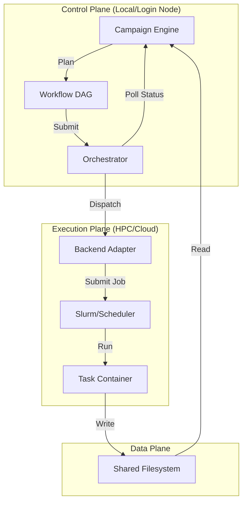

# System Architecture

MatterStack is designed as a layered architecture that separates scientific logic (Campaigns) from execution details (Backends). This separation allows the same scientific code to run on a laptop for debugging and scale to an HPC cluster for production without modification.

## High-Level Overview

The system operates in a cycle: **Plan → Execute → Analyze**.

## Core Components

### 1. The Campaign Engine (`matterstack.campaign.engine`)
The brain of the operation. A `Campaign` is a stateful object that defines the scientific goal.
*   **Responsibility**: Decides *what* to do next based on previous results.
*   **Lifecycle**:
    1.  **Plan**: Generates a `Workflow` (DAG of tasks) for the current iteration.
    2.  **Execute**: Hands off the workflow to the Orchestrator.
    3.  **Analyze**: Consumes the results (Evidence Bundle) and updates internal state (e.g., active learning model).
    4.  **Stop Check**: Decides whether to continue to the next iteration.

### 2. Workspaces
A Workspace is a self-contained directory that encapsulates a specific scientific mission.
*   **Structure**:
    *   `main.py`: Entry point defining the Campaign.
    *   `scripts/`: Python scripts executed by Tasks.
    *   `data/`: Static input data.
    *   `results/`: Artifacts generated by execution.
*   **Philosophy**: Everything needed to reproduce the science is contained within the workspace.

### 3. Task Graph (Workflow) (`matterstack.core.workflow`)
A declarative definition of work.
*   **Workflow**: A Directed Acyclic Graph (DAG) of `Task` objects.
*   **Task**: An atomic unit of work (e.g., "Run VASP calculation", "Train Model").
    *   **Attributes**: Container image, shell command, resource requirements (CPU/GPU/Time), environment variables.
    *   **Dependencies**: Explicit links to other tasks (Task B runs only after Task A succeeds).

### 4. The Orchestrator (`matterstack.orchestration`)
The bridge between the Campaign and the Backend.
*   **Responsibility**: Traverses the Workflow DAG, handles dependencies, and submits ready tasks to the Backend.
*   **Features**:
    *   **Topological Sort**: Ensures tasks run in correct order.
    *   **Fail-Fast vs. Continue-on-Error**: Configurable failure handling.
    *   **Soft Dependencies**: Support for tasks that proceed even if upstream dependencies fail (`allow_dependency_failure=True`).

### 5. Execution Backends (`matterstack.runtime.backends`)
The abstraction layer for compute resources.
*   **LocalBackend**: Runs tasks as subprocesses on the local machine. Ideal for development.
*   **SlurmBackend**: Submits tasks as Slurm jobs via SSH. Handles job scripts, environment loading, and polling.
*   **Interface**: All backends implement a common interface (`submit`, `poll`, `get_logs`, `cancel`), making scientific code platform-agnostic.