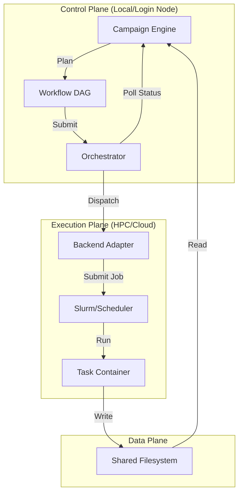

# System Architecture

MatterStack is designed as a layered architecture that separates scientific logic (Campaigns) from execution details (Backends). This separation allows the same scientific code to run on a laptop for debugging and scale to an HPC cluster for production without modification.

## High-Level Overview

The system operates in a cycle: **Plan → Execute → Analyze**.



## Core Components

### 1. The Campaign Engine (`matterstack.campaign.engine`)
The brain of the operation. A `Campaign` is a stateful object that defines the scientific goal.
*   **Responsibility**: Decides *what* to do next based on previous results.
*   **Lifecycle**:
    1.  **Plan**: Generates a `Workflow` (DAG of tasks) for the current iteration.
    2.  **Execute**: Hands off the workflow to the Orchestrator.
    3.  **Analyze**: Consumes the results (Evidence Bundle) and updates internal state (e.g., active learning model).
    4.  **Stop Check**: Decides whether to continue to the next iteration.

### 2. Workspaces
A Workspace is a self-contained directory that encapsulates a specific scientific mission.
*   **Structure**:
    *   `main.py`: Entry point defining the Campaign.
    *   `scripts/`: Python scripts executed by Tasks.
    *   `data/`: Static input data.
    *   `results/`: Artifacts generated by execution.
*   **Philosophy**: Everything needed to reproduce the science is contained within the workspace.

### 3. Task Graph (Workflow) (`matterstack.core.workflow`)
A declarative definition of work.
*   **Workflow**: A Directed Acyclic Graph (DAG) of `Task` objects.
*   **Task**: An atomic unit of work (e.g., "Run VASP calculation", "Train Model").
    *   **Attributes**: Container image, shell command, resource requirements (CPU/GPU/Time), environment variables.
    *   **Dependencies**: Explicit links to other tasks (Task B runs only after Task A succeeds).

### 4. The Orchestrator (`matterstack.orchestration`)
The bridge between the Campaign and the Backend.
*   **Responsibility**: Traverses the Workflow DAG, handles dependencies, and submits ready tasks to the Backend.
*   **Features**:
    *   **Topological Sort**: Ensures tasks run in correct order.
    *   **Fail-Fast vs. Continue-on-Error**: Configurable failure handling.
    *   **Soft Dependencies**: Support for tasks that proceed even if upstream dependencies fail (`allow_dependency_failure=True`).

### 5. Execution Backends (`matterstack.runtime.backends`)
The abstraction layer for compute resources.
*   **LocalBackend**: Runs tasks as subprocesses on the local machine. Ideal for development.
*   **SlurmBackend**: Submits tasks as Slurm jobs via SSH. Handles job scripts, environment loading, and polling.
*   **Interface**: All backends implement a common interface (`submit`, `poll`, `get_logs`, `cancel`), making scientific code platform-agnostic.

### 6. Run Lifecycle States

Each Run goes through a defined lifecycle managed by the Orchestrator and stored in the `StateStore`.

*   **PENDING**: Initialized but not yet started.
*   **RUNNING**: Actively executing the campaign loop.
*   **PAUSED**: Execution suspended by user. No new tasks are submitted.
*   **COMPLETED**: Campaign finished successfully.
*   **FAILED**: Campaign stopped due to errors.
*   **CANCELLED**: Terminated by user request.

### 7. HPC Job States

To ensure determinism across different backends (Slurm, PBS, Local), MatterStack normalizes compute job states into a canonical enum `JobState`.

*   `QUEUED`: Submitted and waiting for resources.
*   `RUNNING`: Actively executing.
*   `COMPLETED_OK`: Finished with exit code 0.
*   `COMPLETED_ERROR`: Finished with non-zero exit code.
*   `CANCELLED`: Stopped by scheduler or user.
*   `LOST`: Backend cannot locate the job (e.g., purged from history).

## Data Layout & Persistence

### Run Directory Structure
MatterStack organizes execution artifacts and state in a structured layout rooted at the run directory. This ensures that all data related to a scientific campaign is self-contained and portable.

```text
/path/to/workspace/runs/<run_id>/
├── state.sqlite        # Single source of truth for run state (SQLite database)
├── run.lock            # File lock for concurrency control
├── campaign_state.json # Checkpointed state of the Campaign object
└── tasks/              # Directory for individual task execution
    ├── task_001/
    │   ├── stdout.log
    │   ├── stderr.log
    │   └── results.json
    └── ...
```

*   **`state.sqlite`**: Stores the Task Graph, status of every task, and metadata. It replaces the need for a separate heavy database server.
*   **`run.lock`**: A zero-byte file used exclusively for locking.
*   **`campaign_state.json`**: Stores the domain-specific scientific state (e.g., active learning model parameters, candidate lists).

### Concurrency & Locking
To support long-running campaigns where multiple processes might interact with the state (e.g., the main loop, manual overrides via CLI, separate operator processes), MatterStack implements a strict file-based locking model.

*   **Mechanism**: We use `fcntl.flock` (exclusive non-blocking lock) on the `run.lock` file.
*   **Behavior**:
    *   Any process attempting to write to `state.sqlite` or modify `campaign_state.json` must first acquire the lock.
    *   If the lock is held by another process, the requester fails fast (or waits, depending on configuration), preventing race conditions.
    *   Reads can be performed without the lock (SQLite handles internal concurrency), but logical consistency for complex updates requires the application-level lock.

This model allows MatterStack to scale from a single laptop to an HPC cluster where multiple job submission scripts might be running simultaneously, ensuring data integrity without complex infrastructure.