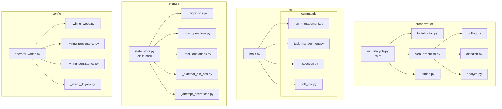

# MatterStack Refactor Plan: Max 500 Lines Per File

## Overview

This document outlines the refactoring plan to ensure all source files in the MatterStack repository are ≤500 lines of code (LOC). The refactor maintains backward compatibility with existing public APIs.

## Baseline Inventory

### Files Exceeding 500 Lines (Mandatory Targets)

| Rank | File | Lines | Excess |
|------|------|-------|--------|
| 1 | `matterstack/orchestration/run_lifecycle.py` | 945 | +445 |
| 2 | `matterstack/cli/main.py` | 897 | +397 |
| 3 | `matterstack/storage/state_store.py` | 740 | +240 |
| 4 | `matterstack/config/operator_wiring.py` | 640 | +140 |
| 5 | `matterstack/runtime/operators/hpc.py` | 564 | +64 |

**Total excess lines**: 1,286 lines over the 500-line limit across 5 files.

### All Source Files (Top 30 by Size)

| Lines | File |
|-------|------|
| 945 | matterstack/orchestration/run_lifecycle.py |
| 897 | matterstack/cli/main.py |
| 740 | matterstack/storage/state_store.py |
| 640 | matterstack/config/operator_wiring.py |
| 564 | matterstack/runtime/operators/hpc.py |
| 389 | matterstack/runtime/backends/local.py |
| 346 | matterstack/orchestration/api.py |
| 336 | matterstack/runtime/backends/hpc/backend.py |
| 321 | matterstack/storage/export.py |
| 290 | matterstack/config/profiles.py |
| 188 | matterstack/storage/schema.py |
| 186 | matterstack/cli/operator_registry.py |
| 123 | matterstack/cli/tui.py |
| 104 | matterstack/core/workflow.py |
| 102 | matterstack/core/backend.py |
| 74 | matterstack/core/operators.py |
| 51 | matterstack/core/domain.py |
| 16 | matterstack/runtime/execution.py |

---

## Refactoring Strategy

### 1. `matterstack/orchestration/run_lifecycle.py` (945 → ~300 lines each)

**Current Responsibilities:**
- Run initialization (`initialize_run`, `initialize_or_resume_run`)
- Step execution (`step_run`) with POLL, PLAN, EXECUTE, ANALYZE phases
- Run loop utilities (`run_until_completion`, `list_active_runs`)
- Status mapping and operator dispatch logic

**Proposed Split:**

```
matterstack/orchestration/
├── __init__.py              # Re-exports for backward compatibility
├── run_lifecycle.py         # Thin shim re-exporting from submodules (~50 lines)
├── initialization.py        # initialize_run, initialize_or_resume_run (~100 lines)
├── step_execution.py        # step_run and internal helpers (~350 lines)
├── polling.py               # POLL phase logic (_task_status_from_external_status, polling attempts) (~150 lines)
├── dispatch.py              # EXECUTE phase logic (operator dispatch, concurrency) (~200 lines)
├── analyze.py               # ANALYZE phase logic (~100 lines)
└── utilities.py             # run_until_completion, list_active_runs (~100 lines)
```

**Module Breakdown:**

| New Module | Content | Est. Lines |
|------------|---------|------------|
| `initialization.py` | `initialize_run()`, `initialize_or_resume_run()` | ~180 |
| `polling.py` | Status mapping, attempt polling, legacy external run polling | ~150 |
| `dispatch.py` | Task submission, operator dispatch, concurrency control | ~200 |
| `analyze.py` | Analyze phase, results construction, campaign state persistence | ~150 |
| `utilities.py` | `run_until_completion()`, `list_active_runs()` | ~120 |
| `step_execution.py` | Main `step_run()` orchestrating the phases | ~150 |

**Compatibility Strategy:**
- Keep `run_lifecycle.py` as a thin re-export shim
- All existing imports like `from matterstack.orchestration.run_lifecycle import initialize_run` continue to work

---

### 2. `matterstack/cli/main.py` (897 → ~250 lines each)

**Current Responsibilities:**
- Command handlers: `cmd_init`, `cmd_step`, `cmd_status`, `cmd_loop`, `cmd_cancel`, `cmd_pause`, `cmd_resume`, `cmd_revive`, `cmd_rerun`, `cmd_attempts`, `cmd_cancel_attempt`, `cmd_export_evidence`, `cmd_explain`, `cmd_monitor`, `cmd_self_test`
- Argparse setup for all subcommands
- `SelfTestCampaign` class
- `main()` entry point

**Proposed Split:**

```
matterstack/cli/
├── __init__.py              # Package init
├── main.py                  # Entry point + argparse setup (~200 lines)
├── commands/
│   ├── __init__.py
│   ├── run_management.py    # init, step, loop, cancel, pause, resume, revive (~200 lines)
│   ├── task_management.py   # rerun, reset, attempts, cancel-attempt (~180 lines)
│   ├── inspection.py        # status, explain, monitor, export-evidence (~200 lines)
│   └── self_test.py         # self-test command and SelfTestCampaign (~80 lines)
├── operator_registry.py     # Existing file (186 lines - OK)
├── reset.py                 # Existing file (OK)
├── tui.py                   # Existing file (123 lines - OK)
└── utils.py                 # Existing file (OK)
```

**Module Breakdown:**

| New Module | Content | Est. Lines |
|------------|---------|------------|
| `main.py` | `main()`, argparse setup, subparser definitions | ~200 |
| `commands/run_management.py` | `cmd_init`, `cmd_step`, `cmd_loop`, `cmd_cancel`, `cmd_pause`, `cmd_resume`, `cmd_revive` | ~250 |
| `commands/task_management.py` | `cmd_rerun`, `cmd_attempts`, `cmd_cancel_attempt`, `_confirm_or_exit` | ~180 |
| `commands/inspection.py` | `cmd_status`, `cmd_explain`, `cmd_monitor`, `cmd_export_evidence` | ~200 |
| `commands/self_test.py` | `SelfTestCampaign`, `cmd_self_test` | ~80 |

**Compatibility Strategy:**
- CLI entry point `matterstack.cli.main:main` remains unchanged
- Internal command functions move to submodules but are not part of public API

---

### 3. `matterstack/storage/state_store.py` (740 → ~350 lines each)

**Current Responsibilities:**
- `SQLiteStateStore` class with:
  - Initialization, schema migration (v1→v2→v3)
  - Run CRUD operations
  - Task CRUD operations
  - External run operations (v1 legacy)
  - Attempt operations (v2)
  - Locking mechanism

**Proposed Split:**

```
matterstack/storage/
├── __init__.py              # Re-exports SQLiteStateStore
├── state_store.py           # Main class, init, schema check, lock (~200 lines)
├── _migrations.py           # Schema migration logic v1→v2→v3 (~150 lines)
├── _run_operations.py       # Run CRUD (create, get, set status) (~120 lines)
├── _task_operations.py      # Task CRUD (add_workflow, get_tasks, etc.) (~150 lines)
├── _external_run_ops.py     # External run operations (v1 legacy) (~120 lines)
├── _attempt_operations.py   # Attempt CRUD (v2) (~200 lines)
├── export.py                # Existing file (321 lines - OK)
└── schema.py                # Existing file (188 lines - OK)
```

**Module Breakdown:**

| New Module | Content | Est. Lines |
|------------|---------|------------|
| `state_store.py` | `SQLiteStateStore` class shell, `__init__`, `_check_schema`, `lock` | ~150 |
| `_migrations.py` | `_migrate_schema_v1_to_v2`, `_migrate_schema_v2_to_v3`, helpers | ~150 |
| `_run_operations.py` | `create_run`, `get_run`, `get_run_metadata`, `set_run_status`, etc. | ~120 |
| `_task_operations.py` | `add_workflow`, `get_tasks`, `get_task_status`, `update_task_status`, `delete_task` | ~150 |
| `_external_run_ops.py` | `register_external_run`, `update_external_run`, `get_external_run`, `get_active_external_runs`, `cancel_external_runs` | ~120 |
| `_attempt_operations.py` | `create_attempt`, `list_attempts`, `get_active_attempts`, `get_current_attempt`, `get_attempt`, `get_attempt_task_ids`, `update_attempt` | ~200 |

**Implementation Approach:**
- Use mixin classes or composition to split the monolithic class
- The main `SQLiteStateStore` class imports and delegates to specialized modules
- All underscore-prefixed modules are internal implementation details

**Compatibility Strategy:**
- Public API `from matterstack.storage.state_store import SQLiteStateStore` unchanged
- All methods remain on `SQLiteStateStore` class

---

### 4. `matterstack/config/operator_wiring.py` (640 → ~300 lines each)

**Current Responsibilities:**
- Data classes: `OperatorWiringSource`, `ResolvedOperatorWiring`, `OperatorWiringProvenance`
- Provenance loading and formatting
- Snapshot persistence and history management
- Legacy operators.yaml generation
- Main `resolve_operator_wiring()` function

**Proposed Split:**

```
matterstack/config/
├── __init__.py
├── operator_wiring.py       # Main resolve function, re-exports (~200 lines)
├── _wiring_types.py         # Data classes and enums (~80 lines)
├── _wiring_provenance.py    # Provenance loading and formatting (~80 lines)
├── _wiring_persistence.py   # Snapshot writing, history, metadata (~250 lines)
├── _wiring_legacy.py        # Legacy operators.yaml generation (~50 lines)
├── operators.py             # Existing file (OK)
└── profiles.py              # Existing file (290 lines - OK)
```

**Module Breakdown:**

| New Module | Content | Est. Lines |
|------------|---------|------------|
| `operator_wiring.py` | `resolve_operator_wiring()`, re-exports of public types | ~200 |
| `_wiring_types.py` | `OperatorWiringSource`, `ResolvedOperatorWiring`, `OperatorWiringProvenance` | ~80 |
| `_wiring_provenance.py` | `load_wiring_provenance_from_run_root`, `format_operator_wiring_explain_line` | ~80 |
| `_wiring_persistence.py` | `_persist_snapshot_bytes`, `_write_metadata`, `_append_history`, `_snapshot_paths` | ~250 |
| `_wiring_legacy.py` | `_generate_legacy_operators_yaml_bytes` | ~50 |

**Compatibility Strategy:**
- Public imports unchanged: `from matterstack.config.operator_wiring import resolve_operator_wiring`
- Data classes re-exported from main module

---

### 5. `matterstack/runtime/operators/hpc.py` (564 → ~280 lines each)

**Current Responsibilities:**
- Config snapshot hashing utilities
- Attempt config snapshot writing
- `ComputeOperator` class: `prepare_run`, `submit`, `check_status`, `collect_results`, `_map_status`

**Proposed Split:**

```
matterstack/runtime/operators/
├── __init__.py
├── hpc.py                   # ComputeOperator class, re-exports (~280 lines)
├── _config_snapshot.py      # Config snapshot utilities (~150 lines)
├── experiment.py            # Existing file (OK)
├── human.py                 # Existing file (OK)
├── manual_hpc.py            # Existing file (OK)
└── registry.py              # Existing file (OK)
```

**Module Breakdown:**

| New Module | Content | Est. Lines |
|------------|---------|------------|
| `hpc.py` | `ComputeOperator` class with all methods | ~350 |
| `_config_snapshot.py` | `_sha256_bytes`, `_compute_combined_config_hash`, `_write_attempt_config_snapshot` | ~150 |

**Note:** After extracting config snapshot utilities, the main `hpc.py` should be around 400 lines. We may need to further split `ComputeOperator` methods if it remains over 500.

**Alternative Split (if needed):**
```
matterstack/runtime/operators/
├── hpc.py                   # ComputeOperator class shell + prepare_run, submit (~280 lines)
├── _hpc_polling.py          # check_status, _map_status (~100 lines)
├── _hpc_results.py          # collect_results (~180 lines)
├── _config_snapshot.py      # Config snapshot utilities (~150 lines)
```

---

## New Module Structure (Final)

```
matterstack/
├── orchestration/
│   ├── __init__.py
│   ├── run_lifecycle.py        # Thin shim with re-exports
│   ├── initialization.py       # Run init logic
│   ├── polling.py              # POLL phase
│   ├── dispatch.py             # EXECUTE phase
│   ├── analyze.py              # ANALYZE phase
│   ├── utilities.py            # Loop and listing utilities
│   ├── step_execution.py       # step_run coordinator
│   ├── api.py                  # Existing (346 lines - OK)
│   ├── diagnostics.py          # Existing (OK)
│   └── results.py              # Existing (OK)
├── cli/
│   ├── __init__.py
│   ├── main.py                 # Entry point + argparse
│   ├── commands/
│   │   ├── __init__.py
│   │   ├── run_management.py
│   │   ├── task_management.py
│   │   ├── inspection.py
│   │   └── self_test.py
│   ├── operator_registry.py    # Existing (OK)
│   ├── reset.py                # Existing (OK)
│   ├── tui.py                  # Existing (OK)
│   └── utils.py                # Existing (OK)
├── storage/
│   ├── __init__.py
│   ├── state_store.py          # Main class shell
│   ├── _migrations.py
│   ├── _run_operations.py
│   ├── _task_operations.py
│   ├── _external_run_ops.py
│   ├── _attempt_operations.py
│   ├── export.py               # Existing (OK)
│   └── schema.py               # Existing (OK)
├── config/
│   ├── __init__.py
│   ├── operator_wiring.py      # Main function + re-exports
│   ├── _wiring_types.py
│   ├── _wiring_provenance.py
│   ├── _wiring_persistence.py
│   ├── _wiring_legacy.py
│   ├── operators.py            # Existing (OK)
│   └── profiles.py             # Existing (OK)
└── runtime/
    └── operators/
        ├── __init__.py
        ├── hpc.py              # ComputeOperator
        ├── _config_snapshot.py
        ├── experiment.py       # Existing (OK)
        ├── human.py            # Existing (OK)
        ├── manual_hpc.py       # Existing (OK)
        └── registry.py         # Existing (OK)
```

---

## Compatibility Strategy

### Re-export Shims

Each refactored module will maintain backward compatibility through re-exports:

```python
# matterstack/orchestration/run_lifecycle.py (shim)
from matterstack.orchestration.initialization import initialize_run, initialize_or_resume_run
from matterstack.orchestration.step_execution import step_run
from matterstack.orchestration.utilities import run_until_completion, list_active_runs

__all__ = [
    "initialize_run",
    "initialize_or_resume_run", 
    "step_run",
    "run_until_completion",
    "list_active_runs",
    "RunLifecycleError",
]
```

### Public API Preservation

All existing import patterns will continue to work:
- `from matterstack.orchestration.run_lifecycle import initialize_run`
- `from matterstack.storage.state_store import SQLiteStateStore`
- `from matterstack.config.operator_wiring import resolve_operator_wiring`

### Internal Modules

Files prefixed with underscore (`_migrations.py`, `_wiring_types.py`, etc.) are internal implementation details and not part of the public API.

---

## Risks and Mitigations

### Circular Imports

**Risk:** Splitting modules may introduce circular dependencies.

**Mitigations:**
1. Extract shared types to lower-level modules (e.g., `_wiring_types.py`)
2. Use local imports in functions where necessary
3. Follow dependency direction: utilities → core logic → orchestration

### Initialization Order

**Risk:** Module-level initialization in the original files may be affected.

**Mitigations:**
1. Audit for module-level side effects before splitting
2. Preserve initialization order in shim modules
3. Add explicit init functions if needed

### Performance

**Risk:** Additional imports may slow startup.

**Mitigations:**
1. Use lazy imports where appropriate
2. Ensure commonly used paths have minimal import chains
3. Profile before/after to verify no significant regression

---

## Implementation Order

Execute refactoring in order of size (largest first):

1. **`run_lifecycle.py`** (945 lines) - Highest priority
2. **`main.py`** (897 lines) - Second priority
3. **`state_store.py`** (740 lines) - Third priority
4. **`operator_wiring.py`** (640 lines) - Fourth priority
5. **`hpc.py`** (564 lines) - Fifth priority

For each file:
1. Create new submodules with extracted code
2. Update imports across the codebase
3. Create backward-compatible shim
4. Run tests to verify functionality
5. Commit with descriptive message

---

## Verification Checklist

### Per-File Verification
- [ ] New modules are all ≤500 lines
- [ ] All tests pass
- [ ] Import statements work correctly
- [ ] No circular import errors

### Final Verification
- [ ] Run `scripts/check_max_lines.sh` (to be created)
- [ ] Full test suite passes
- [ ] CLI commands work: `matterstack init`, `matterstack step`, etc.
- [ ] Package imports work: `import matterstack`

---

## Line Limit Check Script

A new script will be added to enforce the line limit:

```bash
#!/bin/bash
# scripts/check_max_lines.sh
MAX_LINES=500
ERRORS=0

for file in $(find matterstack -name "*.py" -type f); do
    lines=$(wc -l < "$file")
    if [ "$lines" -gt "$MAX_LINES" ]; then
        echo "ERROR: $file has $lines lines (max: $MAX_LINES)"
        ERRORS=$((ERRORS + 1))
    fi
done

if [ "$ERRORS" -gt 0 ]; then
    echo "Found $ERRORS file(s) exceeding $MAX_LINES lines"
    exit 1
fi

echo "All files are within the $MAX_LINES line limit"
exit 0
```

---

## Timeline and Commits

Each file split will be a separate commit:

1. `refactor(orchestration): split run_lifecycle.py into 6 modules`
2. `refactor(cli): split main.py into commands subpackage`
3. `refactor(storage): split state_store.py into operation modules`
4. `refactor(config): split operator_wiring.py into type and persistence modules`
5. `refactor(runtime): extract config snapshot utilities from hpc.py`
6. `chore: add line limit check script and CI integration`
7. `docs: add REFACTOR_MAP.md documenting the restructure`

---

## Appendix: Mermaid Diagram of New Structure



---

## Next Steps

1. **Review this plan** - Confirm the proposed splits make sense
2. **Switch to Code mode** - Implement the refactoring
3. **Run tests** - Verify no regressions
4. **Create REFACTOR_MAP.md** - Document the final mapping
5. **Add CI check** - Ensure line limits are enforced going forward
