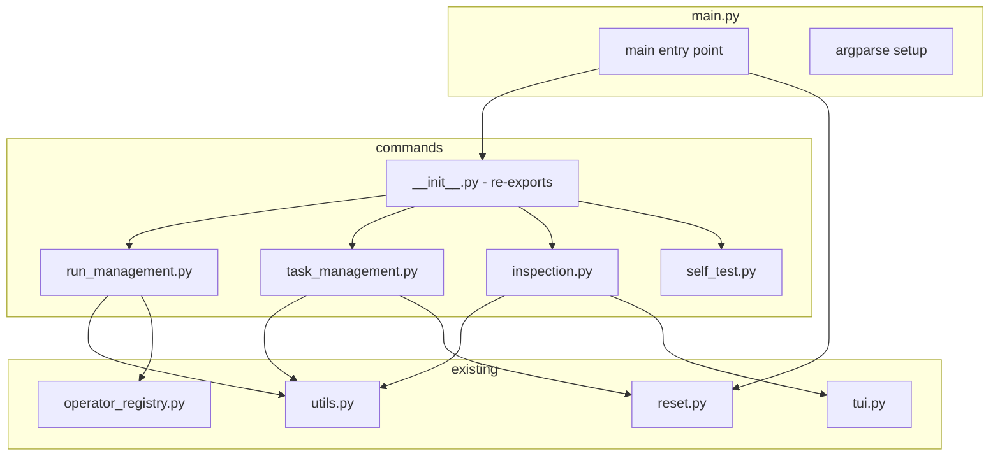

# CLI main.py Split Plan

## Overview

Split [`matterstack/cli/main.py`](matterstack/cli/main.py) (897 lines) into a `commands/` subpackage while preserving the CLI entry point `matterstack.cli.main:main` defined in [`pyproject.toml`](pyproject.toml:21).

## Current Structure Analysis

### main.py Content Breakdown (897 lines)

| Section | Lines | Content |
|---------|-------|---------|
| Imports | 1-38 | Module imports and logging setup |
| `cmd_init` | 40-71 | Initialize a new run |
| `cmd_step` | 73-113 | Execute one step |
| `cmd_status` | 115-141 | Show run status |
| `cmd_loop` | 143-257 | Loop until completion / scheduler mode |
| `cmd_cancel` | 259-276 | Cancel a run |
| `cmd_pause` | 278-295 | Pause a run |
| `cmd_resume` | 297-318 | Resume a run |
| `_confirm_or_exit` | 320-326 | Shared confirmation helper |
| `cmd_revive` | 329-356 | Revive terminal run |
| `cmd_rerun` | 359-430 | Rerun a task |
| `cmd_attempts` | 433-494 | List attempt history |
| `cmd_cancel_attempt` | 497-546 | Cancel an attempt |
| `cmd_export_evidence` | 549-576 | Export evidence bundle |
| `cmd_explain` | 578-628 | Explain run blockers |
| `cmd_monitor` | 630-662 | TUI monitor |
| `SelfTestCampaign` | 664-683 | Self-test campaign class |
| `cmd_self_test` | 685-741 | Self-test command |
| `main()` | 743-897 | Entry point + argparse |

### Shared Dependencies

- [`_confirm_or_exit()`](matterstack/cli/main.py:320) - Used by `cmd_rerun` and `cmd_cancel_attempt`
- [`find_run()`](matterstack/cli/utils.py:51) - Used by most commands
- [`load_workspace_context()`](matterstack/cli/utils.py:7) - Used by run commands
- `logger` - Logging instance needed in all modules

## Target Structure

```
matterstack/cli/
├── __init__.py              # Package init - unchanged, empty
├── main.py                  # Entry point + argparse (~200 lines)
├── commands/
│   ├── __init__.py          # Re-exports all cmd_* functions
│   ├── run_management.py    # Run lifecycle commands
│   ├── task_management.py   # Task-level commands
│   ├── inspection.py        # Status/monitoring commands
│   └── self_test.py         # Self-test command
├── operator_registry.py     # Existing - unchanged (186 lines)
├── reset.py                 # Existing - unchanged (125 lines)
├── tui.py                   # Existing - unchanged (123 lines)
└── utils.py                 # Existing - unchanged (84 lines)
```

## Module Design

### 1. commands/run_management.py (~280 lines)

**Commands:**
- `cmd_init` - Initialize a new run
- `cmd_step` - Execute one step
- `cmd_loop` - Loop until completion or act as scheduler
- `cmd_cancel` - Cancel a run
- `cmd_pause` - Pause a run
- `cmd_resume` - Resume a run
- `cmd_revive` - Revive terminal run

**Imports needed:**
```python
import sys
import logging
import time
import random
from pathlib import Path

from matterstack.orchestration.run_lifecycle import (
    initialize_run, step_run, list_active_runs, run_until_completion
)
from matterstack.storage.state_store import SQLiteStateStore
from matterstack.cli.utils import load_workspace_context, find_run
from matterstack.cli.operator_registry import RegistryConfig, build_operator_registry
from matterstack.config.operator_wiring import resolve_operator_wiring

logger = logging.getLogger("cli.run_management")
```

### 2. commands/task_management.py (~180 lines)

**Commands:**
- `cmd_rerun` - Rerun a task
- `cmd_attempts` - List attempt history
- `cmd_cancel_attempt` - Cancel an attempt
- `_confirm_or_exit` - Shared helper function

**Imports needed:**
```python
import sys
import logging

from matterstack.storage.state_store import SQLiteStateStore
from matterstack.cli.utils import find_run
from matterstack.cli.reset import get_dependents

logger = logging.getLogger("cli.task_management")
```

### 3. commands/inspection.py (~150 lines)

**Commands:**
- `cmd_status` - Show run status
- `cmd_explain` - Explain run blockers
- `cmd_monitor` - TUI monitor
- `cmd_export_evidence` - Export evidence bundle

**Imports needed:**
```python
import sys
import logging

from matterstack.storage.state_store import SQLiteStateStore
from matterstack.storage.export import build_evidence_bundle, export_evidence_bundle
from matterstack.orchestration.diagnostics import get_run_frontier
from matterstack.orchestration.run_lifecycle import list_active_runs
from matterstack.config.operator_wiring import format_operator_wiring_explain_line
from matterstack.cli.utils import find_run
from matterstack.cli.tui import CampaignMonitor

logger = logging.getLogger("cli.inspection")
```

### 4. commands/self_test.py (~80 lines)

**Content:**
- `SelfTestCampaign` class
- `cmd_self_test` command

**Imports needed:**
```python
import sys
import time
import tempfile
from pathlib import Path
from typing import Optional, Any, Dict

from matterstack.core.campaign import Campaign
from matterstack.core.workflow import Workflow, Task
from matterstack.orchestration.run_lifecycle import initialize_run, step_run
from matterstack.storage.state_store import SQLiteStateStore
from matterstack.storage.export import build_evidence_bundle, export_evidence_bundle
```

### 5. commands/__init__.py (~30 lines)

**Re-exports:**
```python
from matterstack.cli.commands.run_management import (
    cmd_init, cmd_step, cmd_loop, cmd_cancel,
    cmd_pause, cmd_resume, cmd_revive,
)
from matterstack.cli.commands.task_management import (
    cmd_rerun, cmd_attempts, cmd_cancel_attempt,
)
from matterstack.cli.commands.inspection import (
    cmd_status, cmd_explain, cmd_monitor, cmd_export_evidence,
)
from matterstack.cli.commands.self_test import cmd_self_test

__all__ = [
    "cmd_init", "cmd_step", "cmd_loop", "cmd_cancel",
    "cmd_pause", "cmd_resume", "cmd_revive",
    "cmd_rerun", "cmd_attempts", "cmd_cancel_attempt",
    "cmd_status", "cmd_explain", "cmd_monitor", "cmd_export_evidence",
    "cmd_self_test",
]
```

### 6. Updated main.py (~200 lines)

**Content:**
- Argparse setup with all subparsers
- `main()` entry point
- Imports from `commands/` package

```python
import argparse

from matterstack.cli.commands import (
    cmd_init, cmd_step, cmd_loop, cmd_cancel,
    cmd_pause, cmd_resume, cmd_revive,
    cmd_rerun, cmd_attempts, cmd_cancel_attempt,
    cmd_status, cmd_explain, cmd_monitor, cmd_export_evidence,
    cmd_self_test,
)
from matterstack.cli.reset import cmd_reset

def main():
    parser = argparse.ArgumentParser(description="MatterStack CLI")
    # ... argparse setup unchanged ...
    
if __name__ == "__main__":
    main()
```

## Line Count Verification

| File | Estimated Lines | Status |
|------|-----------------|--------|
| `main.py` | ~200 | ✅ Under 500 |
| `commands/__init__.py` | ~30 | ✅ Under 500 |
| `commands/run_management.py` | ~280 | ✅ Under 500 |
| `commands/task_management.py` | ~180 | ✅ Under 500 |
| `commands/inspection.py` | ~150 | ✅ Under 500 |
| `commands/self_test.py` | ~80 | ✅ Under 500 |

## Implementation Steps

### Step 1: Create commands/__init__.py
Create the subpackage with initial empty `__init__.py`.

### Step 2: Create commands/run_management.py
Extract: `cmd_init`, `cmd_step`, `cmd_loop`, `cmd_cancel`, `cmd_pause`, `cmd_resume`, `cmd_revive`

### Step 3: Create commands/task_management.py
Extract: `_confirm_or_exit`, `cmd_rerun`, `cmd_attempts`, `cmd_cancel_attempt`

### Step 4: Create commands/inspection.py
Extract: `cmd_status`, `cmd_explain`, `cmd_monitor`, `cmd_export_evidence`

### Step 5: Create commands/self_test.py
Extract: `SelfTestCampaign`, `cmd_self_test`

### Step 6: Update commands/__init__.py
Add all re-exports.

### Step 7: Update main.py
- Remove command function definitions
- Import from `commands/` package
- Keep argparse setup and `main()`

### Step 8: Test
```bash
# Run all tests
pytest tests/ -v

# Verify CLI works
python -m matterstack.cli.main --help
matterstack --help
```

## Critical Requirements Preserved

1. **Entry Point Unchanged**: `matterstack.cli.main:main` in pyproject.toml works
2. **Command Names Unchanged**: All CLI subcommands work identically
3. **Shared Utilities**: `_confirm_or_exit` placed in task_management with re-export if needed
4. **Reset Command**: `cmd_reset` remains in `reset.py` - already correctly separated

## Dependency Graph



## Notes

- No changes needed to existing `reset.py` - it already contains `cmd_reset` and `get_dependents`
- The argparse setup is verbose (~155 lines) but stays in `main.py` for clarity
- Each command module has its own logger instance for better traceability
- `_confirm_or_exit` is only used in task_management, so it stays there
