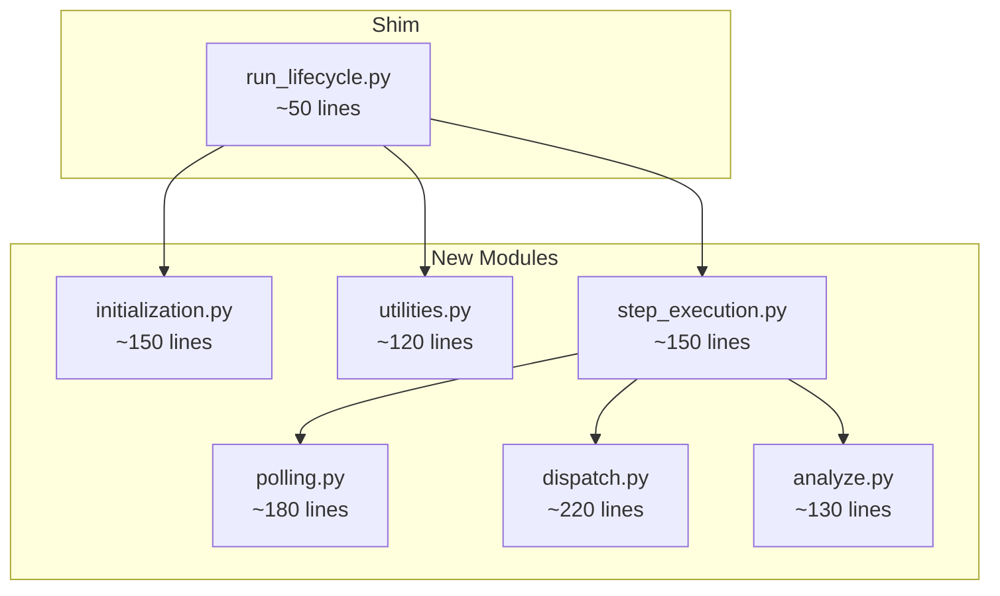

# run_lifecycle.py Split Plan

## Summary

Split `matterstack/orchestration/run_lifecycle.py` (945 lines) into 6 cohesive modules while maintaining full backward compatibility.

## Current Structure Analysis

### Functions/Classes in run_lifecycle.py

| Item | Lines | Location |
|------|-------|----------|
| `RunLifecycleError` | 25-26 | Exception class |
| `initialize_run()` | 28-79 | ~52 lines |
| `initialize_or_resume_run()` | 81-184 | ~104 lines |
| `step_run()` | 187-835 | ~649 lines |
| `run_until_completion()` | 837-892 | ~56 lines |
| `list_active_runs()` | 894-945 | ~52 lines |

### step_run() Internal Phases

| Phase | Lines | Description |
|-------|-------|-------------|
| POLL | 219-421 | ~200 lines - Poll attempts and external runs |
| PLAN | 423-506 | ~84 lines - Check deps, find ready tasks |
| EXECUTE | 508-731 | ~224 lines - Submit tasks to operators |
| ANALYZE | 732-835 | ~104 lines - Collect results, replan |

### Helper Functions Inside step_run()

| Function | Lines | Purpose |
|----------|-------|---------|
| `_task_status_from_external_status()` | 225-240 | Status mapping |
| `_lookup_operator_for_attempt()` | 275-305 | Operator lookup |
| `_resolve_operator_key_for_dispatch()` | 555-572 | Operator key resolution |

## Imports Used Across All Locations

```
# 15 files import from run_lifecycle.py

matterstack/__init__.py:
  - initialize_run, run_until_completion

matterstack/orchestration/__init__.py:
  - initialize_run, step_run

matterstack/cli/main.py:
  - initialize_run, step_run, list_active_runs, run_until_completion

tests/unit/orchestration/test_resume.py:
  - initialize_or_resume_run, initialize_run, RunHandle (re-export)

tests/unit/core/test_scheduler_multi.py:
  - initialize_run, step_run, list_active_runs

tests/integration/test_concurrency_caps.py:
  - step_run, RunHandle (re-export)

tests/conftest.py:
  - initialize_run

(8 other integration/e2e tests):
  - initialize_run, step_run
```

## Proposed Module Split

### Dependency Graph



### Module Details

#### 1. initialization.py (~150 lines)

**Content:**
- `RunLifecycleError` exception class
- `initialize_run()` function
- `initialize_or_resume_run()` function

**Imports:**
```python
from __future__ import annotations
import logging
import uuid
from pathlib import Path
from typing import Optional
from datetime import datetime, timezone

from matterstack.core.run import RunHandle, RunMetadata
from matterstack.core.campaign import Campaign
from matterstack.storage.state_store import SQLiteStateStore
```

**Exports:**
- `RunLifecycleError`
- `initialize_run`
- `initialize_or_resume_run`

---

#### 2. polling.py (~180 lines)

**Content:**
- `_task_status_from_external_status()` - status mapping helper
- `poll_active_attempts()` - attempt polling logic
- `poll_legacy_external_runs()` - v1 fallback polling
- `_lookup_operator_for_attempt()` - operator lookup helper

**Imports:**
```python
from __future__ import annotations
import logging
from pathlib import Path
from typing import Dict, Any, Optional, List

from matterstack.core.operators import ExternalRunHandle, ExternalRunStatus
from matterstack.core.operator_keys import (
    resolve_operator_key_for_attempt,
    legacy_operator_type_to_key,
)
```

**Exports:**
- `task_status_from_external_status`
- `poll_active_attempts`
- `poll_legacy_external_runs`
- `lookup_operator_for_attempt`

---

#### 3. dispatch.py (~220 lines)

**Content:**
- `_resolve_operator_key_for_dispatch()` - operator key resolution
- `calculate_concurrency_slots()` - slot availability
- `submit_task_to_operator()` - operator dispatch logic
- `submit_external_task_stub()` - stub for ExternalTask/GateTask
- `submit_local_simulation()` - local task simulation

**Imports:**
```python
from __future__ import annotations
import logging
import json
from pathlib import Path
from typing import Dict, Any, Optional, List

from matterstack.core.run import RunHandle
from matterstack.core.workflow import Task
from matterstack.core.operators import ExternalRunStatus
from matterstack.core.external import ExternalTask
from matterstack.core.gate import GateTask
from matterstack.core.operator_keys import (
    is_canonical_operator_key,
    legacy_operator_type_to_key,
    normalize_operator_key,
)
```

**Exports:**
- `resolve_operator_key_for_dispatch`
- `calculate_concurrency_slots`
- `submit_task_to_operator`
- `submit_external_task_stub`
- `submit_local_simulation`

---

#### 4. analyze.py (~130 lines)

**Content:**
- `build_task_results()` - construct results dict from tasks
- `load_campaign_state()` - load state from JSON
- `persist_campaign_state()` - save state to JSON
- `execute_analyze_phase()` - orchestrate analyze + replan

**Imports:**
```python
from __future__ import annotations
import logging
import json
from pathlib import Path
from typing import Dict, Any, Optional, List

from matterstack.core.run import RunHandle
from matterstack.core.campaign import Campaign
from matterstack.core.workflow import Task
```

**Exports:**
- `build_task_results`
- `load_campaign_state`
- `persist_campaign_state`
- `execute_analyze_phase`

---

#### 5. utilities.py (~120 lines)

**Content:**
- `run_until_completion()` - blocking execution loop
- `list_active_runs()` - active run discovery

**Imports:**
```python
from __future__ import annotations
import logging
import time
from pathlib import Path
from typing import Dict, Any, Optional, List

from matterstack.core.run import RunHandle
from matterstack.core.campaign import Campaign
from matterstack.storage.state_store import SQLiteStateStore
```

**Exports:**
- `run_until_completion`
- `list_active_runs`

---

#### 6. step_execution.py (~150 lines)

**Content:**
- `step_run()` - main coordinator function
- Inline operator registry construction (if not provided)

**Imports:**
```python
from __future__ import annotations
import logging
from pathlib import Path
from typing import Dict, Any, Optional

from matterstack.core.run import RunHandle
from matterstack.core.campaign import Campaign
from matterstack.core.operators import ExternalRunStatus
from matterstack.core.external import ExternalTask
from matterstack.core.gate import GateTask
from matterstack.storage.state_store import SQLiteStateStore

# Internal imports from new modules
from matterstack.orchestration.polling import (
    task_status_from_external_status,
    poll_active_attempts,
    poll_legacy_external_runs,
)
from matterstack.orchestration.dispatch import (
    calculate_concurrency_slots,
    submit_task_to_operator,
    submit_external_task_stub,
    submit_local_simulation,
)
from matterstack.orchestration.analyze import execute_analyze_phase
```

**Exports:**
- `step_run`

---

#### 7. run_lifecycle.py (Shim ~50 lines)

**Content:**
```python
"""
Backward-compatible shim for run_lifecycle.py

All implementations have been moved to submodules:
- initialization.py: Run init and resume logic
- polling.py: POLL phase logic
- dispatch.py: EXECUTE phase logic
- analyze.py: ANALYZE phase logic
- step_execution.py: Main step_run coordinator
- utilities.py: Loop and discovery utilities

This module re-exports all public APIs to maintain backward compatibility.
"""
from __future__ import annotations

# Re-export from initialization
from matterstack.orchestration.initialization import (
    RunLifecycleError,
    initialize_run,
    initialize_or_resume_run,
)

# Re-export from step_execution
from matterstack.orchestration.step_execution import step_run

# Re-export from utilities
from matterstack.orchestration.utilities import (
    run_until_completion,
    list_active_runs,
)

# Re-export RunHandle for backward compatibility (used in some tests)
from matterstack.core.run import RunHandle

__all__ = [
    "RunLifecycleError",
    "initialize_run",
    "initialize_or_resume_run",
    "step_run",
    "run_until_completion",
    "list_active_runs",
    "RunHandle",
]
```

## Circular Import Prevention

### Import Direction Rules

1. **Lower-level modules do NOT import from higher-level:**
   - `polling.py` does NOT import from `step_execution.py`
   - `dispatch.py` does NOT import from `step_execution.py`
   - `analyze.py` does NOT import from `step_execution.py`

2. **Peer modules do NOT import from each other:**
   - `polling.py` does NOT import from `dispatch.py` or `analyze.py`
   - `dispatch.py` does NOT import from `polling.py` or `analyze.py`
   - `analyze.py` does NOT import from `polling.py` or `dispatch.py`

3. **step_execution.py imports from all phase modules**

4. **utilities.py imports only from step_execution** (for `step_run` call)

### Dependency Matrix

| Module | Can Import From |
|--------|-----------------|
| `initialization.py` | core/*, storage/* |
| `polling.py` | core/* |
| `dispatch.py` | core/* |
| `analyze.py` | core/* |
| `step_execution.py` | core/*, storage/*, polling, dispatch, analyze |
| `utilities.py` | core/*, storage/*, step_execution |
| `run_lifecycle.py` | initialization, step_execution, utilities, core/run |

## Implementation Steps

### Step 1: Create initialization.py
1. Copy `RunLifecycleError` class
2. Copy `initialize_run()` function
3. Copy `initialize_or_resume_run()` function
4. Add required imports

### Step 2: Create polling.py
1. Extract `_task_status_from_external_status()` as `task_status_from_external_status()`
2. Extract `_lookup_operator_for_attempt()` as `lookup_operator_for_attempt()`
3. Extract attempt polling loop as `poll_active_attempts()`
4. Extract legacy external run polling as `poll_legacy_external_runs()`

### Step 3: Create dispatch.py
1. Extract `_resolve_operator_key_for_dispatch()` as `resolve_operator_key_for_dispatch()`
2. Extract concurrency calculation as `calculate_concurrency_slots()`
3. Extract operator submission as `submit_task_to_operator()`
4. Extract stub creation as `submit_external_task_stub()`
5. Extract simulation as `submit_local_simulation()`

### Step 4: Create analyze.py
1. Extract results construction as `build_task_results()`
2. Extract state loading as `load_campaign_state()`
3. Extract state persistence as `persist_campaign_state()`
4. Extract analyze orchestration as `execute_analyze_phase()`

### Step 5: Create utilities.py
1. Copy `run_until_completion()` function
2. Copy `list_active_runs()` function
3. Update imports

### Step 6: Create step_execution.py
1. Create `step_run()` as coordinator
2. Import from phase modules
3. Orchestrate phases in sequence

### Step 7: Update run_lifecycle.py
1. Replace all implementations with imports
2. Re-export all public APIs
3. Include `RunHandle` re-export

### Step 8: Update orchestration/__init__.py
No changes needed - it imports from `run_lifecycle.py` which is the shim.

### Step 9: Run Tests
```bash
pytest tests/ -v
```
All 213 tests must pass.

### Step 10: Verify Line Counts
```bash
wc -l matterstack/orchestration/*.py
```
All files must be ≤500 lines.

## Expected File Sizes

| File | Expected Lines |
|------|----------------|
| `initialization.py` | ~150 |
| `polling.py` | ~180 |
| `dispatch.py` | ~220 |
| `analyze.py` | ~130 |
| `utilities.py` | ~120 |
| `step_execution.py` | ~150 |
| `run_lifecycle.py` | ~50 |
| **Total** | ~1000 |

Note: Total is slightly higher than original 945 lines due to:
- Module docstrings
- Import statements duplicated across files
- `__all__` declarations
- Function signatures extracted from inline helpers

## Testing Checklist

- [ ] `from matterstack.orchestration.run_lifecycle import initialize_run` works
- [ ] `from matterstack.orchestration.run_lifecycle import step_run` works
- [ ] `from matterstack.orchestration.run_lifecycle import run_until_completion` works
- [ ] `from matterstack.orchestration.run_lifecycle import list_active_runs` works
- [ ] `from matterstack.orchestration.run_lifecycle import initialize_or_resume_run` works
- [ ] `from matterstack.orchestration.run_lifecycle import RunLifecycleError` works
- [ ] `from matterstack.orchestration.run_lifecycle import RunHandle` works (re-export)
- [ ] `from matterstack.orchestration import initialize_run, step_run` works
- [ ] `from matterstack import initialize_run, run_until_completion` works
- [ ] All 213 tests pass
- [ ] No circular import errors at module load time
