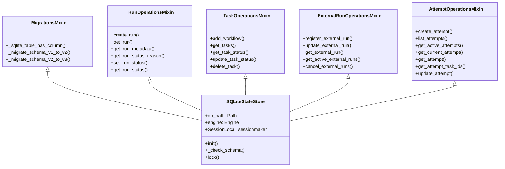

# State Store Split Plan

## Overview

This document details the plan for splitting `matterstack/storage/state_store.py` (740 lines) into 6 cohesive modules using a **mixin pattern**. The goal is to maintain `SQLiteStateStore` as the single public class while reducing the main file to ~200 lines.

## Current Method Inventory

### SQLiteStateStore Class Methods (740 lines total)

| Method | Lines | Responsibility |
|--------|-------|----------------|
| `__init__` | 42-63 | Initialization, engine creation, schema check |
| `_sqlite_table_has_column` | 65-68 | Migration utility |
| `_migrate_schema_v1_to_v2` | 70-137 | Schema migration v1→v2 |
| `_migrate_schema_v2_to_v3` | 139-155 | Schema migration v2→v3 |
| `_check_schema` | 157-200 | Schema version check & migration dispatch |
| `lock` | 202-226 | File locking context manager |
| `create_run` | 228-247 | Run CRUD |
| `get_run` | 249-265 | Run CRUD |
| `get_run_metadata` | 267-283 | Run CRUD |
| `get_run_status_reason` | 285-291 | Run CRUD |
| `set_run_status` | 293-308 | Run CRUD |
| `get_run_status` | 310-316 | Run CRUD |
| `add_workflow` | 318-355 | Task CRUD |
| `get_tasks` | 357-395 | Task CRUD |
| `get_task_status` | 397-403 | Task CRUD |
| `update_task_status` | 405-412 | Task CRUD |
| `delete_task` | 414-427 | Task CRUD |
| `register_external_run` | 429-458 | External Run (v1 legacy) |
| `update_external_run` | 460-476 | External Run (v1 legacy) |
| `get_external_run` | 478-496 | External Run (v1 legacy) |
| `get_active_external_runs` | 498-526 | External Run (v1 legacy) |
| `cancel_external_runs` | 528-550 | External Run (v1 legacy) |
| `create_attempt` | 554-608 | Attempt (v2) |
| `list_attempts` | 610-620 | Attempt (v2) |
| `get_active_attempts` | 622-638 | Attempt (v2) |
| `get_current_attempt` | 640-653 | Attempt (v2) |
| `get_attempt` | 655-662 | Attempt (v2) |
| `get_attempt_task_ids` | 664-676 | Attempt (v2) |
| `update_attempt` | 678-740 | Attempt (v2) |

---

## Mixin Architecture



---

## Module Layout

### 1. `state_store.py` (Main Class Shell) - ~180 lines

**Contents:**
- Imports from all mixin modules
- `CURRENT_SCHEMA_VERSION` constant
- `SQLiteStateStore` class definition inheriting from all mixins
- `__init__()` method (engine creation, directory setup, schema check)
- `_check_schema()` method (dispatches to migration mixins)
- `lock()` context manager

**Key Design:**
```python
from matterstack.storage._migrations import _MigrationsMixin
from matterstack.storage._run_operations import _RunOperationsMixin
from matterstack.storage._task_operations import _TaskOperationsMixin
from matterstack.storage._external_run_ops import _ExternalRunOperationsMixin
from matterstack.storage._attempt_operations import _AttemptOperationsMixin

CURRENT_SCHEMA_VERSION = "3"

class SQLiteStateStore(
    _MigrationsMixin,
    _RunOperationsMixin,
    _TaskOperationsMixin,
    _ExternalRunOperationsMixin,
    _AttemptOperationsMixin,
):
    def __init__(self, db_path: Path):
        # ... initialization ...
    
    def _check_schema(self) -> None:
        # ... schema check, calls mixin migration methods ...
    
    @contextlib.contextmanager
    def lock(self) -> Generator[None, None, None]:
        # ... file locking ...
```

### 2. `_migrations.py` - ~150 lines

**Contents:**
- `TASK_ATTEMPT_MIGRATION_NAMESPACE` constant (UUID for deterministic migration)
- `_MigrationsMixin` class with:
  - `_sqlite_table_has_column(session, table, column)` - utility
  - `_migrate_schema_v1_to_v2(session, info)` - v1→v2 migration
  - `_migrate_schema_v2_to_v3(session, info)` - v2→v3 migration

**Dependencies:**
- `sqlalchemy` (text, select, insert, update)
- `schema.py` models: `Base`, `SchemaInfo`, `TaskAttemptModel`, `TaskModel`, `RunModel`, `ExternalRunModel`

### 3. `_run_operations.py` - ~120 lines

**Contents:**
- `_RunOperationsMixin` class with:
  - `create_run(handle, metadata)` - create new run record
  - `get_run(run_id)` - retrieve run handle by ID
  - `get_run_metadata(run_id)` - retrieve full run metadata
  - `get_run_status_reason(run_id)` - get status reason for run
  - `set_run_status(run_id, status, reason)` - update run status
  - `get_run_status(run_id)` - get current run status

**Dependencies:**
- `matterstack.core.run` - `RunHandle`, `RunMetadata`
- `schema.py` - `RunModel`

### 4. `_task_operations.py` - ~150 lines

**Contents:**
- `_TaskOperationsMixin` class with:
  - `add_workflow(workflow, run_id)` - persist workflow tasks
  - `get_tasks(run_id)` - retrieve all tasks for a run
  - `get_task_status(task_id)` - get task internal status
  - `update_task_status(task_id, status)` - update task status
  - `delete_task(task_id)` - delete task and related records

**Dependencies:**
- `matterstack.core.workflow` - `Task`, `Workflow`
- `matterstack.core.external` - `ExternalTask`
- `matterstack.core.gate` - `GateTask`
- `schema.py` - `TaskModel`, `ExternalRunModel`

### 5. `_external_run_ops.py` - ~150 lines

**Contents:**
- `_ExternalRunOperationsMixin` class with:
  - `register_external_run(handle, run_id)` - register new external run
  - `update_external_run(handle)` - update external run
  - `get_external_run(task_id)` - get external run by task ID
  - `get_active_external_runs(run_id)` - get non-terminal runs
  - `cancel_external_runs(task_id)` - cancel active runs for task

**Dependencies:**
- `matterstack.core.operators` - `ExternalRunHandle`, `ExternalRunStatus`
- `schema.py` - `ExternalRunModel`

### 6. `_attempt_operations.py` - ~220 lines

**Contents:**
- `_AttemptOperationsMixin` class with:
  - `create_attempt(...)` - create new task attempt (v2)
  - `list_attempts(task_id)` - list all attempts for task
  - `get_active_attempts(run_id)` - get non-terminal attempts
  - `get_current_attempt(task_id)` - get current attempt via pointer
  - `get_attempt(attempt_id)` - get attempt by ID
  - `get_attempt_task_ids(run_id)` - get task IDs with attempts
  - `update_attempt(...)` - update existing attempt

**Dependencies:**
- `matterstack.core.operators` - `ExternalRunStatus`
- `schema.py` - `TaskAttemptModel`, `TaskModel`

---

## File Structure After Refactoring

```
matterstack/storage/
├── __init__.py              # Export SQLiteStateStore
├── state_store.py           # Main class shell (~180 lines)
├── _migrations.py           # Schema migration logic (~150 lines)
├── _run_operations.py       # Run CRUD operations (~120 lines)
├── _task_operations.py      # Task CRUD operations (~150 lines)
├── _external_run_ops.py     # External run ops v1 (~150 lines)
├── _attempt_operations.py   # Attempt ops v2 (~220 lines)
├── schema.py                # SQLAlchemy models (unchanged, 188 lines)
└── export.py                # Evidence export (unchanged, 321 lines)
```

---

## Implementation Steps

### Step 1: Create `_migrations.py`
Extract migration methods from state_store.py into a new mixin class.

### Step 2: Create `_run_operations.py`
Extract run CRUD methods into a new mixin class.

### Step 3: Create `_task_operations.py`
Extract task CRUD methods into a new mixin class.

### Step 4: Create `_external_run_ops.py`
Extract external run (v1 legacy) methods into a new mixin class.

### Step 5: Create `_attempt_operations.py`
Extract attempt (v2) methods into a new mixin class.

### Step 6: Update `state_store.py`
- Remove extracted methods
- Add mixin inheritance
- Keep `__init__`, `_check_schema`, `lock`
- Ensure `CURRENT_SCHEMA_VERSION` is defined and accessible to migrations

### Step 7: Update `__init__.py`
Add export for `SQLiteStateStore`:
```python
from matterstack.storage.state_store import SQLiteStateStore

__all__ = ["SQLiteStateStore"]
```

### Step 8: Run Tests
```bash
# Run storage-specific tests first
pytest tests/integration/test_state_store_sqlite.py -v

# Run full test suite
pytest tests/ -v
```

### Step 9: Verify Line Counts
All new files should be ≤500 lines.

### Step 10: Commit
```bash
git add matterstack/storage/
git commit -m "refactor(storage): split state_store.py into mixin modules"
```

---

## Critical Considerations

### 1. Mixin Type Hints
Each mixin needs proper type hints for `self.SessionLocal` and `self.db_path`. Use `TYPE_CHECKING` imports:

```python
from typing import TYPE_CHECKING

if TYPE_CHECKING:
    from pathlib import Path
    from sqlalchemy.orm import sessionmaker
```

### 2. Avoiding Circular Imports
- Mixins MUST NOT import from `state_store.py`
- All mixins import from `schema.py` and core modules only
- Constants like `CURRENT_SCHEMA_VERSION` should be passed as parameters or accessed via `self`

### 3. Session Management Pattern
All mixins use the same pattern:
```python
with self.SessionLocal() as session:
    # database operations
    session.commit()
```

### 4. Migration Constants
`TASK_ATTEMPT_MIGRATION_NAMESPACE` is only used in `_migrations.py` so it can stay there.
`CURRENT_SCHEMA_VERSION` is needed in both `state_store.py` (for `_check_schema`) and potentially migrations - define it in `state_store.py` and import in migrations if needed, or pass as parameter.

---

## Test Coverage

The following test file covers `SQLiteStateStore`:
- `tests/integration/test_state_store_sqlite.py` - 149 lines

Tests cover:
- Store initialization
- Run create/get
- Workflow persistence
- Task status updates
- External run lifecycle
- Persistence across instances

---

## Success Criteria

- [ ] `state_store.py` ≤200 lines
- [ ] `_migrations.py` ≤500 lines
- [ ] `_run_operations.py` ≤500 lines
- [ ] `_task_operations.py` ≤500 lines
- [ ] `_external_run_ops.py` ≤500 lines
- [ ] `_attempt_operations.py` ≤500 lines
- [ ] All tests pass (211+ expected)
- [ ] Import `from matterstack.storage.state_store import SQLiteStateStore` works
- [ ] Existing code using `SQLiteStateStore` unchanged
